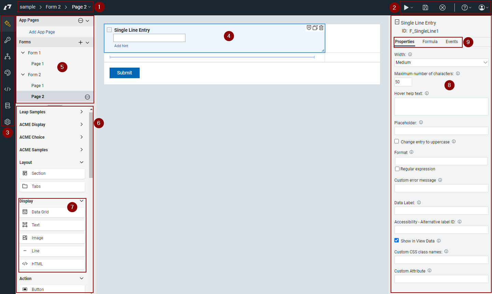

# Using the Editor

This topic provides details on using the {{shortProductName}} Editor.

## Editor Overview

1. Navigation breadcrumb. You can click the last item to change the page on the canvas.
2. Save, Preview, Close and Info links.
3. {{shortProductName}} Navigation. Use this to move around to the different pages of {{shortProductName}}: Design, Access, Workflow, Style, Events, Validation, and Settings.
4. Design Canvas.  This space represents your form.  It is made up of rows and columns.  Only 1 item may be placed into a cell.  You can add or remove rows/columns by clicking on the buttons at the outer edges of the canvas.
5. Outline View.  This shows the forms, pages, app pages and tables. Clicking on an object in this view will reveal its properties in the property pane.
6. Item Palette.  Click an item for it to appear in the currently selected cell or click and drag to the desired cell.
7. Palette drawer. Items have been grouped into categories and placed in a drawer that can be collapsed.
8. Properties Pane.  Each item has properties that can be set.  Clicking on an item will reveal its properties in this pane.
9. Item configuration tabs: Properties, Formula, Events. These tabs reveal functionality that can be configured for the selected item.

## Additional Topics

-   **[Basic Concepts](editor_basics.md)**  
Basic concepts related to using the editor.

-   **[Palette items](editor_palette_items.md)**  
A description of all the palette items.

-   **[Copying items](cr_copying_items.md)**  
Items may be copied from one form to another form within any application.

-   **[Moving items on a form](cr_moving_items_on_a_form.md)**  
Form items are not static after they are added to a form. You can move items around on a single page, duplicate form items, and move items between pages on your form.

-   **[Creating an accessible application](ac_creating_accessible_application.md)**  
When you create a form or application, the following information helps you design an accessible form for users with disabilities.

-   **[Enabling dynamic layout](cr_enabling_dynamic_layout.md)**  
When you build applications, you can now set the display width of your {{shortProductName}} application. Setting this feature reduces or removes the need for horizontal scrolling when you have an unknown or limited amount of space, such as when the application is displayed on a mobile device.

-   **[Adding specialized form items](wi_introduction_to_specialized_form_items.md)**  
You can use specialized form items to style text, echo text back, create dynamic lines, or add HTML.

-   **[Managing the files associated with your application](wf_managing_the_files_associated_with_your_appl.md)**  
You can upload a variety of files, such as images, for use with your application. Managing these embedded files is done in the Files section of the Settings tab

**Parent topic:** [Building Apps](cr_creating_and_managing_toc.md)