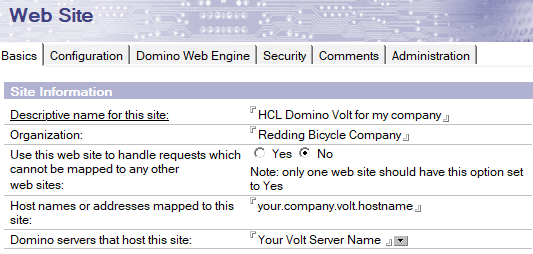
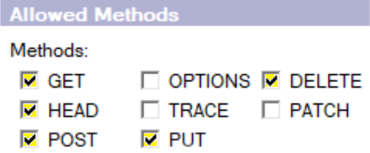
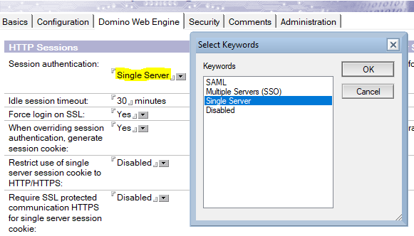
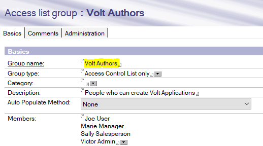
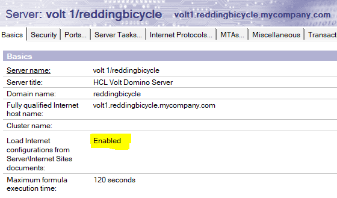
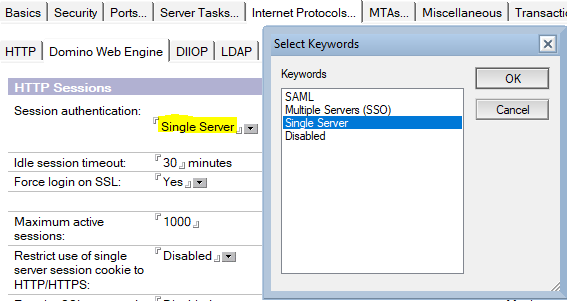

# Configuring the server

HCL Domino Leap requires session-based authentication and certain HTTP settings to be enabled on the server. These can be configured by either setting the values in the notes.ini file and Server document, or by using an Internet Site document.


## Server configuration - notes.ini

If you are not going to use Internet Site documents, enable the HTTP methods GET, DELETE, HEAD, POST, and PUT by setting the property HTTPEnableMethods in the notes.ini file. You may enable other methods, but these are the minimum that must be enabled for Domino Leap to operate.

```
HTTPEnableMethods=GET,POST,PUT,DELETE,HEAD 
```

For higher volume Domino Leap servers, it may be necessary to increase the memory available to the Domino Leap server while processing requests.

In the servers's notes.ini file, add the following lines:

```
HTTPJVMMaxHeapSize=2048M
```

This increases the available memory for Domino Leap from the default of 1GB to 2GB.

```
HTTPJVMMaxHeapSizeSet=1
```

This prevents the server from setting the heap size back to default when the server is upgraded in the future.


## Server configuration - internet site

If using Internet Site documents, create and enable a Web Site document for the HCL Domino Server on which HCL Domino Leap will be hosted.

1. From the Domino Administrator client, click Configuration > Web > Internet Sites.

2. Click **Add Internet Site**, select **Web**.

3. Fill out the Descriptive Name, Organization, and other fields on the **Basics** tab.

    

4. On the **Configuration** tab, enable the methods GET, DELETE, HEAD, POST, and PUT. You may enable other methods, but these are the minimum that must be enabled for Domino Leap to operate.allowed methods for server configuration on internet

    

5. On the **Domino Web Engine** tab, ensure that Session authentication is enabled. This can be set to whatever you are using for your environment (SAML, SSO, or Single Server). If you do not already have SAML or SSO in place, then set this to Single Server.

    

6. Review the settings on the **Security** tab and ensure they are appropriate for your environment.

7. Save and close the Internet site document.

For detailed reference instructions on preparing a Web Site document, see [Creating an Internet site document]({{dominoDocBaseUrl}}inst_creatinganinternetsitedocument_t.html).


## Conditional server configuration – Domino Leap Authors Group

You may want to restrict who can create Domino Leap applications.  The recommended method is to use a Group document.

1. From the Domino Administrator client, click **People & Groups** > **Domino Directories** > **Groups**.

2. Click **Add Group**.

3. Name the group whatever you wish – just make note of the name as you will be using it in subsequent steps. See Post-installation tasks for more information.

    !!! note
        An example for a group name is "Domino Leap App Authors".

4. Add the users for your environment who will be allowed to create Domino Leap apps.

    

5. Save and close the Group document.

6. Add the newly created group to the ACL for the Leap Builder.nsf. Assign a minimum access level of **Editor** with **Delete documents**.


## Server configuration – server document

HCL Domino Leap requires some specific settings on the Server document for proper operation.

1. From the Domino Administrator client, click **Configuration** > **Server** > **All Server Documents**.

2. Select the Server document for the server which will host the HCL Domino Leap Domino installation and click **Edit Server**.

3. If you are using Internet Site documents, ensure that **Load Internet configurations from Server\Internet Sites documents** is enabled on the **Basics** tab.

    

4. If you are not using Internet Site documents, ensure that Session authentication is enabled on the **Internet Protocols** > **Domino Web Engine** tab. This can be set to whatever you are using for your environment (SAML, SSO, or Single Server). If you do not already have SAML or SSO in place, then set this to Single Server.

    

5. Save and close the Server document.

For more information on server documents, see [Understanding the Server document]({{dominoDocBaseUrl}}othr_serverdocument_r.html).

!!! note
    HCL Domino Leap displays a login form to authenticate a user. When you load the login form using the HTTP protocol, your credentials are sent to the Domino server over an insecure connection. For a production server, it is strongly recommended you configure the server to require an SSL connection (HTTPS). For information on requiring an SSL connection, see [Requiring an SSL connection to a server]({{dominoDocBaseUrl}}conf_requiringansslconnectiontoaserver_t.html).


## Server configuration - Enabling TransactionLogging for improved deployment recovery

Domino Leap supports enabling transactions for improved deployment recovery. If deployments fail, Domino Leap can rollback most changes if transaction logging is enabled on the server. While deployment failures are rare, this reduces the potential for applications being in an inconsistent state. With transaction logging enabled, in the event of a deployment failure, the application can be reset to the previous good state without administrator intervention. Though enabling transaction logging is not required, enabling transaction logging on your Domino Leap server is helpful in the unlikely case of a deployment failure.

!!! note
    Transactions must be enabled on the Domino server for deployment recovery improvement. Customers who are enabling transaction logging for the first time should use circular logging with 4GB maximum log space setting. For more information on transaction logging, see the following topics:

- [Setting up a Domino server for transaction logging]({{dominoDocBaseUrl}}admn_settingupadominoserverfortransactionlogging_t.htm)
- [How transaction logging works]({{dominoDocBaseUrl}}admn_howtransactionloggingworks_r.md)
- [Deploying an application](cr_deploying_an_application.md)


**Parent topic:** [Installing Domino Leap](dleap_install_overview.md)