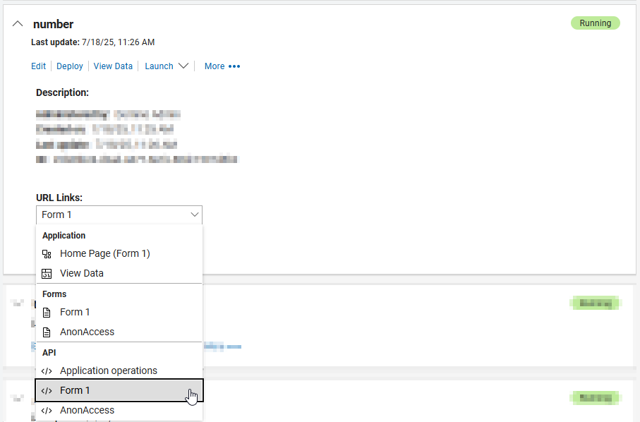

# Data access REST API { #ref_rest_public_REST_API .reference }

The data access REST API exposes operations on application submitted data, also known as records.

The data that is captured by a {{fullProductName}} application is stored in a relational Domino  database. {{shortProductName}} provides secure access to that data through the View Data function, which lets you filter and search, as well as export data for analysis and reports. When accessing the data using the API, all security permissions defined in the Access rules for the application are enforced.

Each form in an application has its own set of REST endpoints.  

## Swagger UI

To get the API definition for a specific form, on the **Manage** page, expand the application details and select the form name in the **URL Links** dropdown.

Clicking the launch button will open the Swagger UI to interact with the API definition.

To access the Swagger UI directly, use ../{{context}}/open/swagger-ui/index.html?url=/{{apiContext}}/anon\|secure/org/data/\{app\_uid\}/\{form\_id\}/openapi.json.  

The definition includes detail about the form and its fields. Check the **FormFields** under the **Schema** section to see the fields on the form and any specific input constraints that the author might have configured. These can include required fields, a number field that only accepts values 1-100, a date field expecting a date within a specific range, and others).

The Swagger UI can be used to execute any of the API operations.

!!!note
    Only users with Administrator role (or a role with "create" permission) may access the api definition.

!!!note
    Some operations have prerequisites that must be performed first. For example, you must first submit a file through the attachment endpoint before submitting a form with an attachment input item.

## Available API Endpoints

|URL|HTTP Verb Header|Action Name|
|---|----------------|-----------|
|/{{apiContext}}/secure\|anon/org/data/\{app-uid\}/\{form-id\}|GET|[List](ref_data_rest_api_list.md)|
|/{{apiContext}}/secure\|anon/org/data/\{app-uid\}/\{form-id\}/\{record-uid\}|GET|[Retrieve](ref_data_rest_api_retrieve.md)|
|/{{apiContext}}/secure\|anon/org/data/\{app-uid\}/\{form-id\}|POST|[Create](ref_data_rest_api_create.md)|
|/{{apiContext}}/secure\|anon/org/data/\{app-uid\}/\{form-id\}/\{record-uid\}|PUT|[Update](ref_data_rest_api_update.md)|
|/{{apiContext}}/secure\|anon/org/data/\{app-uid\}/\{form-id\}/\{record-uid\}|DELETE|[Delete](ref_data_rest_api_delete.md)|
|/{{apiContext}}/secure\|anon/org/data/\{app-uid\}/\{form-id\}/attachment/\{attachment-uid\}|GET|[Retrieve Attachment](ref_data_rest_api_retrieve_attachment.md)|
|/{{apiContext}}/secure\|anon/org/data/\{app-uid\}/\{form-id\}/attachment/|POST|[Create Attachment](ref_data_rest_api_create_attachment.md)|

-   **app-uid**: is the UID of the application
-   **form-id**: is the ID of the form
-   **record-uid**: is the UID of the record
-   **attachment-uid**: is the UID of the attachment
-   **x**: is a randomly generated, difficult to guess single-use numerical value

-   The context for the REST API \(/{{apiContext}}/\) is different from accessing {{shortProductName}} in the browser \(/{{context}}/\).
-   The /{{apiContext}}/ context uses basic authentication rather than form-based authentication.
-   The credentials used for authentication must match the users and permissions specified by the application designer in the **Access** tab. Each form and stage can have different permissions set for each REST API action.
-   Use /anon if your applications allow anonymous access.

All dates, times, and timestamps must be listed in ISO 8601 format.

!!!note
    All examples in this documentation use the program curl, which is available on most Linux™ systems, and can be downloaded for Windows™. However, you can use any tool or library for calling the REST API. For example, the Poster add-on for FireFox is useful for experimenting with the REST API.

**Parent topic:** [REST API reference](ref_rest_api_ref.md)

