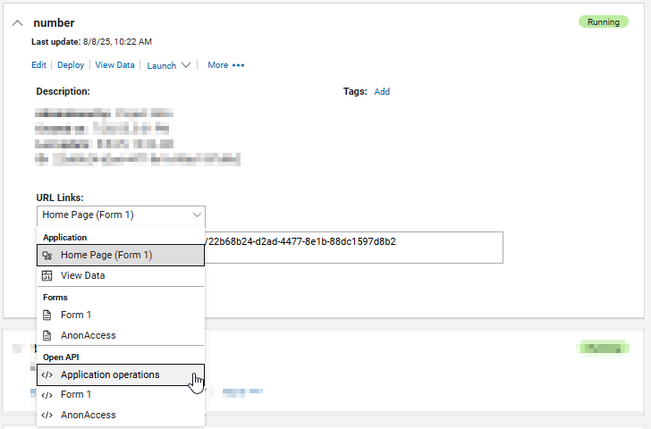

# Application management REST API { #ref_rest_api_auto_deploy .reference }

The Application management REST API allows for programmatic import, export, upgrade, and delete of {{shortProductName}} applications. 

To get the API definition for a specific application, expand the application details and select **Application Operations** in the **URL Links** dropdown.



To get the generic application management operations, use {{context}}/open/swagger-ui/index.html?url=%2F{{context}}%2Fsecure%2Forg%2Fapp%2Fopenapi.json

## Authentication { .section}

All REST API calls must be made as an authenticated user. If you want to exercise the API with code, then, you can use basic authentication. The authenticated user must be a valid user of {{shortProductName}} and must have the appropriate permission. The primary mechanism is to use basic authentication where the username and password are a Base64 encoded string.

## REST actions { .section}

The following table lists the types of actions that are available and the URLs associated with those actions.

|URL|HTTP Verb Header|Action Name|
|---|----------------|-----------|
|/{{apiContext}}/secure/org/app/app-uid/archive?mode=source&submitted=true|GET|Export|
|/{{apiContext}}/secure/org/app/app-uid/archive?replaceEmbeddedData=on&runDatabaseUpgradeNow=on&replaceSubmittedData=on|POST|Upgrade|
|/{{apiContext}}/secure/org/app?deploy=false&importData=false|POST|Import|
|/{{apiContext}}/secure/org/app/app-uid|DELETE|Delete|
|/{{context}}/secure/org/app/app-uid/archive/exportAppToFile?filePath=serverPath&exportData=false"|GET|ExportAppToFile|
|/{{context}}/secure/org/app/importAppFromFile|POST|ImportAppFromFile|

## Export { .section}

Exports the defined application as a .nitro\_s file. You can use the following parameters to export the application:

#### `submitted=true` 
Can be set to **true** or **false**. **true** returns the application and all submission data that exists in the application.

!!! note
    If no value is passed, then the default is **true**.

## Upgrade { .section}

Allows the user to upgrade the content of an application to match the application that is contained in the POST request. You can use the following parameters to upgrade the application:

#### `replaceSubmittedData=off`
Can be **on** or **off**. **on** replaces the existing submission data with the submission data contained in the application being uploaded.

!!! note
    The default for replaceSubmittedData is **off**.

The upgraded application must be uploaded to the server as multipart/form-data in the body of the POST.

## Import { .section}

Imports the specified application into the {{shortProductName}} server. The user that performs the import is automatically added as an administrator. You can use the following parameters to import the application:

#### `deploy=false`
Can be set to **true** or **false**. **true** automatically deploys the application as part of the import.

!!! note
    The default is **false**.

#### `importData=false`
Can be set to **true** or **false**. **true** imports the submission data, or submitted records, if they were included when the application was exported.

!!! note
    The default is **false**.

#### `cleanIds=false`
Can be set to **true** or **false**. **true** removes all groups and users from roles within the imported application ensuring that only the current authenticated user has access to the application.

!!! note
    The default is **false**.


The application to be imported must be uploaded to the server as multipart/form-data.

## Delete { .section}

Deletes the specified application from the server.

## Export App To File { .section}

If you have a {{shortProductName}} application that is very large (i.e. lots of submitted records and/or lots of attachments), then you may want to have your admin export the application directly to the server file system.  Saving the file directly to the server will avoid browser or HTTP time-outs that you might experience with large files.

This endpoint is only accessible by users in the AdministrativeUsers security role.

#### `filePath=x`
The value of *x* must be a valid local path on the {{shortProductName}} server.

#### `exportData=false`
Can be set to **true** or **false**. If **true**, all the data will be extracted with the application.

The instruction can be issued from a browser where {{shortProductName}} is loaded.  Using the browser console enter the content as:

```
dojo.xhrGet({ 
  url : "../app/<appid>/archive/exportAppToFile?filePath=<exportPathOnServer>&exportData=<true/false>" 
});
```

The application will be exported, there will be no confirmation message returned by the endpoint.

## Import App From File { .section}

If you have a {{shortProductName}} application that is very large (i.e. lots of submitted records and/or lots of attachments), then you may want to have your admin import the application directly from the server file system.  Load in the file directly from the server will avoid browser or HTTP time-outs that you might experience with large files.

This endpoint is only accessible by users in the AdministrativeUsers security role.

#### `request-body`
The request body must be a JSON object.

```
{ 
    "filePath" : "/{{context}}/feb/_export_import/MyApp.nitro_s",
    "cleanIds" : false,
    "deploy" : true,
    "importData" : true
}
```

- filePath. The local path on the {{shortProductName}} server where the app resides
- cleanIds. Valid values are true and false.  If true, all user and groups will be purged from roles within the app
- deploy. Valid values are true and false.  If true, the app will be deployed.
- importData. Valid values are true and false. If true, the app data will be imported.

The instruction can be issued from a browser where {{shortProductName}} is loaded.  Using the browser console enter the content as:

```
importFileData = { 
    "filePath" : "/{{context}}/feb/_export_import/MyApp.nitro_s",
    "cleanIds" : false,
    "deploy" : true,
    "importData" : true
};  
dojo.xhrPost({
    postData : JSON.stringify(importFileData),
    url : "../app/importAppFromFile",
    headers : { "Accept": "application/json", "Content-Type" : "application/json"}
});
```

The application will be imported, there will be no confirmation message returned by the endpoint.  Refresh the Manage page to see the application once the import is complete.

## Basic Application Flow { .section}

This is the basic flow of an application communicating with the {{shortProductName}} REST API:

1.  Establish a URLConnection with the URL that matches the action you want.
2.  Set the basic authentication credentials into the URLConnection.
3.  Set extra headers or body content if required for the action.
4.  Process the response.

**Parent topic:** [REST API reference](ref_rest_api_ref.md)

