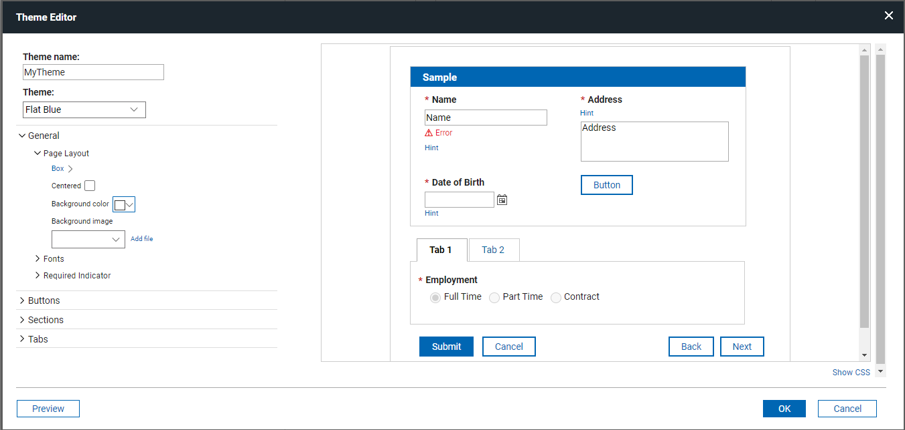

# Styling your application with a custom theme { #concept_bwx_vwd_gy .concept }

You can enhance your application's appearance by creating or importing a custom theme. Each application can have only one theme, which applies to all forms within the application.

## Theme Customization

Themes are configured in the **Style** tab, where you can modify colors, fonts, and other visual elements.

### General Settings

- Adjustments made in the **General** section of the **Theme Editor** affect all items in your application. However, more specific settings will override these.

For example, fonts set in **General** > **Fonts** > **General** can be overridden by values in **General** > **Fonts** > **Label Fonts** or **Buttons** > **Fonts**.

### Background and Borders

- Section background colors and border visibility can be customized through individual item properties, overriding theme settings.

- Background images maintain their aspect ratio but stretches to fit the browser window.

## Previewing and Compatibility

- Custom themes and CSS are not applied during design but can be previewed using the Preview button in the Theme Editor or the main banner.

- Different browsers support different font file types (for example, .woff, .woff2, .ttf, .eot, .otf). To ensure compatibility, include multiple formats when specifying custom fonts.

## Exporting and Importing Themes

- Themes can be exported and imported into another application.

- To improve portability, you can maintain a link to external files (such as fonts and background images) instead of importing them directly into the application.

## Using Custom CSS

- Custom CSS can be used alongside themes.

- By default, custom CSS is applied after the theme’s styling. However, selecting the **Replace Theme** option will apply only the custom CSS.

- CSS precedence rules still apply, meaning some theme styles may override custom CSS unless specifically accounted for.

- The **Show CSS** feature in the **Style** tab helps developers understand the CSS generated by the theme.

- Custom CSS is not applied to the sample form in the **Theme Editor**, but it is applied to the sample form in the **Style** tab.

**Parent topic:** [Styling your application](st_style_application.md)

