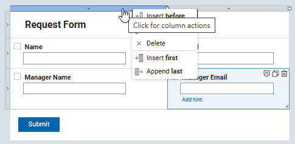
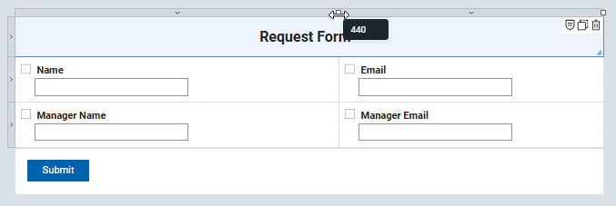
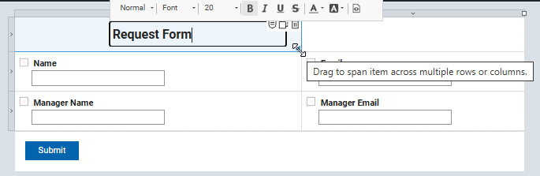
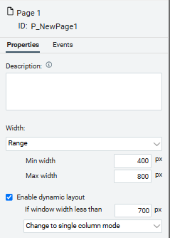
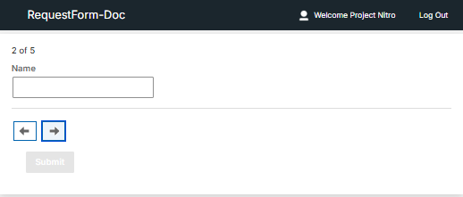

# Editor Basics

## Canvas Grid

You can modify the canvas layout by clicking on the outer edge. Columns and rows can be inserted, appended, or deleted to achieve your desired layout. New columns or rows will be added relative to the point where you clicked on the outer edge.

Columns may be resized by clicking on the white square and dragging it in either direction.  As you move the mouse, a label will appear showing the column's current width.

Items may fill more than one cell of the grid. To do this, click and drag the triangle in the lower-right corner of an item to extend it across multiple rows or columns.

## Form Settings

There are a few high level form settings that can change the run-time behavior of the form you build.

### Label Alignment

Label Alignment defines where field labels will appear.  The default position is above the item, but you may also choose left or right.

### Limit 1 submission per user

Enabling this property ensures that an authenticated user can submit only one instance of the form. If the user has already submitted the form, visiting the base URL again will load their previously submitted form, provided they still have read access.

!!!note
    This feature will not restrict Anonymous users from submitting multiple times.

### Change submission behavior

Changing this property can significantly impact how your application behaves when a form is submitted.

There are 3 options:

- **Show the success message page** (default)
- **Show the success message in a dialog and then display a new form**. This mode is helpful for applications where a single user submits multiple records in a single sitting.
- **Show the success message in a dialog and then display the next stage of the form**. This mode is helpful if a single user submits a form and continues to work on it through its various workflow stages.

The content for the success message is defined in the properties of the **Submit** button that is clicked.

!!!note
    If you delete the submit message text within a submit button's properties, no message will be displayed when the button is clicked.

### Call service to pre-populate form

Using a service when the form is new can be a great way to seed the form with information for the user.  An example would be to pre-load information about the current user (such as, name, email, manager, and others) from the corporate directory.

The following services can be called:

- **On display of new form**. Best used for loading information that only needs to be loaded once at the beginning of a form's life-cycle.

- **On re-load of existing form**. Best used for loading content that may change as the form moves through its life-cycle.

## Page Settings

### Dynamic Layout

To make your form pages responsive for displaying on various screen sizes, define the behavior parameters in the page settings.

There are 2 mode:

- **Change to single column mode**. When the page width is less than the specified value, all items will dynamically shift to display in a single column.

- **Change to carousel mode**. When the page width is less than the specified value, items will be presented one at a time in a carousel format.

**Parent topic:** [Using the editor](cr_using_the_editor_toc.md)