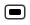
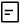
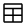
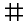
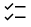

# Which palette item should I use?

The widgets (or items from the palette) you use in your form significantly influence how the form behaves at runtime (while you end users are filling out the form), the design options available for you, and how easily data is interpreted on the **View Data** page.

When designing forms, select items that best align with the data types of your questions. For instance, use the **Number** item for numeric questions instead of a **Single Line Entry** field. The **Number** field automatically validates numeric input  when a user fills in the form and allows you to define acceptable ranges. Additionally, data from Number fields can be easily summarized in charts and graphs on the View Data page, whereas data from Single Line Entry fields cannot.

Proper widget selection is crucial, as changing a widget type will result in the loss of existing data. For example, replacing a **Single Line Entry** field with a **Currency** field will erase all previously submitted data from the original field. Therefore, carefully consider the appropriate item types during form design to preserve data integrity.

Using the correct widget types also allows you to easily build **Rules** and **Formulas** into your form, as the Rules and Formula's tabs use the type of item to help you build your logic. 

There are various specialized items available in the palette, each designed with specific validation and configuration options to ensure accurate data captured. For instance, use **Date** fields for date information, **Time** fields for times of day, **Currency** fields for monetary values, and others.  Its also important to understand what types of items will be automatically summarized in the charts and graphs of the **View Data** page.

The following table describes each item type and what type of specialized properties can be set in its **Properties** as well as an indicator that lets you know if it will automatically be summarized as a chart in the **View Data** page.

## Non-Chart-able Palette Items

### {: .palette-image-alignment} Attachment

Attachment allows for the attachment of a single file to the form.  If the form is being rendered in an iOS6 device, then this will allow images to be attached.  Images can either be captured from the camera or chosen from the camera roll.

### {: .palette-image-alignment} Button

Button is a generic button that can be modified to carry out custom actions. A button can navigate to other forms or applications, it can call a service or execute custom javaScript.  You can specify images to be used in place of the default button styling.

### {: .palette-image-alignment} DataGrid

The Data grid is a complex item that can be used to display data from a form within the same application.  The data can be filtered, sorted and includes built-in pagination.

### {: .palette-image-alignment} Email

Email is a **Single Line Entry** field that has validation logic to ensure a proper email address is entered.	

### {: .palette-image-alignment} HTML

HTML is an item which can show custom HTML markup. Any CSS added to the form also applies to this markup.	

### {: .palette-image-alignment} Image

An Image item is used to add an image to the form.  Use Image to add banners, headers, or footers. Allows for upload of image off disk, or reference image on web.

### {: .palette-image-alignment} Line

A horizontal line. You can change the thickness and color in the Designer.

### {: .palette-image-alignment} Multi-Line Entry

Multi Line Entry captures multiple lines of data, which is useful for capturing a large amount of text, such as comment fields.	

You can specify the number of rows to be displayed to the user.

### {: .palette-image-alignment} Namepicker

Namepicker is a dynamic field that will return a list of users or groups that match the search string provided. The user can then select the desired user or group.

### {: .palette-image-alignment} Page Navigation

Page Navigation adds a set of smart next and previous buttons to the form to allow the user to navigate between pages.  Page
navigation is only needed when your form contains more than one page.	

Can specify button images and location of buttons (header,  footer, or in-place).

### {: .palette-image-alignment} Section	

A Section is used to contain other items and is useful for grouping items together. Sections can contain other sections.

Allows the user to collapse and expand the section in the form.

### {: .palette-image-alignment} Single Line Entry

A Single Line Entry captures a single line of data, such as a First Name.	

You can specify the maximum number of allowable characters as well as the format to validate user input.  The patterns are easy to enter by following the instructions in the help text (below).

Limits and adjusts the user's input to specific formats. Enter patterns as:

`# for numbers 0-9`
`@ for letters A-Z`
`? for numbers or letters`

Example patterns:

`@@@###` (3 letters and 3 numbers)
`#####, #####-####` (US zip code)
`HR-????` ('HR-' followed by any 4 numbers or letters)

Or enter a sample of the required format, such as a phone number:

`(555) 123-4567`

Multiple patterns are entered as a comma separated list.

To use a regular expression, select the **Regular expression** checkbox. There are a lot of good references online for regular expressions to validate common patterns.

!!!note
   In regular expressions, do not include leading and trailing forward slashes. You may use ^ and $ to indicate the beginning and end of a pattern. For example, the pattern ```/^\d+(,\d{1,2})?-.+\(\d+\)$/``` will cause an error. You may use ```^\d+(,\d{1,2})?-.+\(\d+\)$``` instead.

Provided below are a few simple patterns:

**US/Can Phone Number:** `\(\d{3}\) \d{3}-\d{4}`

**Canadian Postal Code:** `[A-Z][0-9][A-Z] [0-9][A-Z][0-9]`

**US Zip Code:** `\d{5}(-\d{4})?`

### {: .palette-image-alignment} Survey

A Survey item presents a survey style question format. The user is asked a series of questions, and is provided a series of choices to answer the questions. Allows for entry of choice list values and questions. Also allows for either select one or select many mode.

### {: .palette-image-alignment} Tabbed Folder

Tabbed Folder is another type of container which is effectively has one or more sections in single location. Each section is accessible by clicking its “tab”. You can add, remove, or rename the tabs

### {: .palette-image-alignment} Table
Table is a data table with rows and columns of data which have been input using a child form defined when configuring this item. You can control button layout, style and names. It allows number of rows as well as width of columns to be specified.

### {: .palette-image-alignment} Text
A Text item is used to present formatted text to the user.

Text items are useful for headings, long descriptions, instructions, and legal text. It presents a rich text editor for entering formatted text and images.

### {: .palette-image-alignment} Time

Time provides a time picker for the capturing of time of day information.	

You can specify the time format and allowable range.

### {: .palette-image-alignment} Time Stamp

Time Stamp is combination of a Date item and a Time item to create a single “time stamp” value. It allows valid ranges to be specified as well as controlling the date and time formats.

### {: .palette-image-alignment} Website

Website is an entry field with a constraint which requires a URL that begins with http://, https://, ftp://, or ftps://	

### {: .palette-image-alignment} Link

Web Link is highlighted text that, when selected, opens the specified URL in a new browser tab or window.	Can provide a Link Alias to  show “friendlier” link text and specify the URL.


## Chart-able Palette Items

### {: .palette-image-alignment} Check

A Check represents a single check box to the user allowing them to specify a true or false answer.

### {: .palette-image-alignment} Choice Slider

A Choice Slider is a slider object where the choices are string values. 
There is no limit to the number of choices that can be defined and the slider locks to each choice defined. However, if you provide too many choices then the UI may become "messy", ideal implementation of this item is generally less than 10 choices.	

You can define the start and stop labels which are shown at the edges of the item and hide the choice (tick) labels.

### {: .palette-image-alignment} Currency

Currency is a Single Line Entry field that contains validation logic to ensure a currency amount is entered.  A numeric value is entered, and the field formats the number into the specified currency format.  If the validation fails the user is not allowed to submit the form.	

You can specify the currency type and the allowable range.

### {: .palette-image-alignment} Date

Date provides a date picker for the capturing of date information.

You can specify the date format and allowable range.

### {: .palette-image-alignment} Drop Down

Drop Down presents a list of choices to the user when the drop-down is selected.  The user must choose one of the choices provided.

Allows for entry of choice list values, or can hook up to. The service retrieves choice list values from external system.

### {: .palette-image-alignment} Number

Number is a Single Line Entry field that contains validation logic to ensure a number is entered.  Number also contains properties that allow you to control the range and format of how the number is displayed.  If the validation fails, the user is not allowed to submit the form.	

You can specify the allowable range, and number format (found in the Advanced tab).

### {: .palette-image-alignment} Numeric Slider

A Numeric Slider is a slider object where the choices are numbers. The number of choices are defined by properties in the item, where you set the Start and Stop values and then the Number of Ticks. 

You can force the slider to Snap to ticks, specify start and stop labels, show tick labels and assign custom CSS class name.

### {: .palette-image-alignment} Select Many

Select Many presents a list of options to the user, from which the user can select any number of the options.  Also referred to as a check group.	

Allows for entry of choice list values and either horizontal or vertical alignment of choice list as well as specifying the number of choices that must be selected.

### {: .palette-image-alignment} Select One

Select One presents a list of options to the user, from which the user can only select one.  Also referred to as a radio group.	

Allows for entry of choice list and either horizontal or vertical alignment of choice list.

**Parent topic:** [Using the editor](cr_using_the_editor_toc.md)