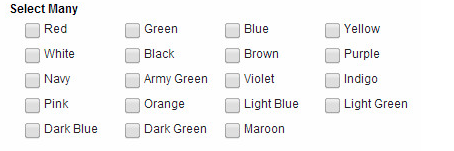

# Styling your application

This topic provides details on improving the look of your application by apply and working with CSS.

## Styling your application with a custom theme

[Styling your application with a custom theme](cr_custom_theme.md) provides details on styling the colors, fonts, and other characteristics of the application by creating or importing a custom theme.

<!---   An application can have one theme; the theme is applied to all forms in the application.
-   Themes are customized in the **Style** tab.
-   Settings made in the **General** section of the **Theme Editor** will be applied to specific attributes of all items in your application, but will be overridden by settings made to a more specific item type. For example, settings made in **General** \> **Fonts** \> **General** can be overridden by values set in **General** \> **Fonts** \> **Label Fonts** or set in **Buttons** \> **Fonts**.
-   A section's background color and border visibility can be set in the item's properties. This will override the theme settings.
-   Background images maintain aspect ratio, but are stretched to fit the browser window.
-   During application design, themes, and custom CSS are not applied to your application. To see how your application will display to end users, use the **Preview** button in either the **Theme Editor** dialog or the main banner.
-   Browsers support different font file types \(eg. .woff, .woff2, .ttf, eot, and .otf\), so when specifying a custom font in your theme, you may need to include multiple font file types for a specific font family in order for it to render in all browsers.
-   Themes can be exported and then imported into another application.
    -   To increase the portability of your customized theme, use the option to **Maintain a link to the file only** for font files and background image, instead of importing them into your application.
-   Some limitations exist in IE8, including differences around the way IE8 displays background images.
-   Custom CSS can be used in combination with themes.
    -   Custom CSS that you have included in your application is applied after all theme styling is applied except when the replace theme checkbox is selected. In this case, the custom CSS is the only styling that is applied to your application. CSS precedence rules still apply though, so some custom CSS may not override all theme settings.
    -   The **Show CSS** feature in the **Style** tab can be used by custom CSS developers to understand the CSS that is being generated by the theme.
    -   Custom CSS is not applied to the sample form in the **Theme Editor** dialog but is applied to the sample form in the **Style** tab.-->

## Using CSS files

[Using CSS files](ex_css_toc.md) details the use of custom CSS themes that can be uploaded into an application to style the user interface to meet customer needs.


## Creating a global corporate theme

{{shortProductName}} provides the ability to create your own global (or corporate) theme that can be selected from the application creation dialog.


- A global corporate theme must be configured by the {{shortProductName}} server admin using the {{shortProductName}} properties.
- The CSS file that contains all the custom classes must be created and hosted in an accessible location.

The following is an example of a corporate theme configuration:


```text
ibm.nitro.NitroConfig.customThemes.1.displayName = Corporate Theme 1
ibm.nitro.NitroConfig.customThemes.1.nl.fr=Thème d'entreprise 1
ibm.nitro.NitroConfig.customThemes.1.isDefault = false
ibm.nitro.NitroConfig.customThemes.1.location = http://pnp.hcl.com/theme1.css
```



```text
customThemes.1.displayName = Corporate Theme 1
customThemes.1.nl.fr=Thème d'entreprise 1
customThemes.1.isDefault = false
customThemes.1.location = http://pnp.hcl.com/theme1.css
```


## Using Custom css class name

Forms, pages and items have a property called "Custom CSS class names".  This property accepts one or more class names separated by spaces.  The class name provided is added to the object and can be referenced by a CSS class definition.  

For example, if you added 'redBackground" to the 'Custom CSS class names" property, you could define the following class to change the styling for that item:

```css
.lfMn .redBackground {
  background: red;
}
```

!!! note
    In some situations you may need to override a default styling by adding "!important" to the style definition.

## Using in-line CSS

Custom CSS styles can also be added to the form in an HTML item and they will be evaluated when the form is loaded.  Styles defined like this only apply when the form they are contained in is loaded.

```html
<style>
  
.lfMn.lotusui30 .lotusBanner
{
  display:none;
}
.lfMn.lfSingleFormArea .lfFormTitleBar {
  display:none;
}
  
</style>
```

## Using custom fonts

You can use custom fonts in your applications.

Either attach or reference the font files in the Settings / Files tab.  If you are referencing the files via URL make sure you have the correct permission to do so otherwise they will not load. 

Once attached or referenced the fonts will appear in your font options in the Style Editor.

### Using Google Fonts

Google offers over 600 font families for web developers. They are free, easy to use and reliability is excellent. This brief tutorial will tell you what you need to know to use Google fonts in your applications.

1. Go to the [Google font library](http://www.google.com/fonts) and select your fonts. Once you chose the font you want click the Quick-use icon.

2. Download the font and add to your form OR add the font to your style sheet.

3. Create and apply classes that use the Google font

    **Example of class that references the font attached to the form**

    ```css
    .lfMn .rancho
    {
      font-family: 'Rancho', cursive !important;
      color: blue !important;
    }
    ```

    **Example of css file that imports the font**

    ```css
    @import url(https://fonts.googleapis.com/css2?family=Rancho&display=swap);

    .lfMn .rancho
    {
      font-family: 'Rancho', cursive !important;
      color: blue !important;
    }
    ```

    !!! note
        the css file must be added to the form and selected on the Style page.

4. Launch the form to see the font appear in the form! 

## Reference application-embedded files in CSS classes

You can reference files that are attached to your application (at design-time) in your CSS styles.  

Add the file to your application.  Click on **Settings** > **Files** > **Add**, and add the file.

- if the file is an image then it will be stored internally in an **image** folder. 
- if the file is css then it will be stored in a **styles** folder 
- any other file will be stored in a **files** folder.

The CSS class may use a relative URL to refer to the attached file:

```css
.lfAppMainArea {
    background-image:url("../image/myImage.png");
    background-repeat:repeat;
}
```

## Samples

Use one of the techniques for adding the CSS to your application, then add the style name to the **Custom CSS class names** field of the item being styled.

### Hide Banner

Hides the {{shortProductName}} header/banner at the top of the form.

```css
.lfMn.lotusui30 .lotusBanner
{
  display:none;
}
```

### Hide Form Toolbar

Hides the form toolbar that contains the print and delete button for a submitted form.

```css
.lfMn.lfSingleFormArea .lfFormTitleBar {
  display:none;
}
```

### Change field label color

```css
.lfMn .redLabel .lfFormLabel  {
  color: red;
}
```

!!!note
    If you want to rename the style then change **redLabel** to the desired name. You can also add additional properties to further adjust the style.

### Change cursor pointer

CSS provides several different ways to change the mouse pointer.  Check out W3Schools to see all the available [cursor styles](https://www.w3schools.com/cssref/pr_class_cursor.php).

```css
/* changes the cursor from arrow to pointer */
.lfMn .cursor {
  cursor: pointer;
}

/* changes the cursor from arrow to hourglass */
.lfMn .wait_cursor,
.lfMn .wait_cursor * {
    cursor: wait !important;
}
```

A common technique is to change the mouse pointer to the hourglass if a service is executing. When triggering the service call, add the **wait_cursor** style to the form page and remove it using an onCallFinished handler.

### Center Image

This example will give you the capability of centering an image in the viewable window.

```css
.lfMn.lotusui30 .lfCenterImage img   {
  margin-left: auto;     margin-right: auto;     display: block; 
}
```

### Change vertical alignment of a checkbox

The check object by default aligns with the label of other items.  You may want it to align with the input field.

```css
.lfMn .lfCheckCenteredWithField {  
  margin-top: 23px; 
}
```

!!!note
    You could also choose to override the existing checkbox class "lfFormFieldCheckBox", which will apply the change to ALL checkbox items.

### Change field alignment

Sets the field value to be aligned on the right.

```css
.lfMn .rightAlign .dijitTextBox {
  text-align: right;
}
```

### Customize navigation, submit, and cancel buttons

You can customize the look and color of buttons within your form to better suit your businesses branding. In this example we are changing the background and font color as well as the font size on the button.

1. Create a CSS class. For this example we used ```BlueButton.css```attached below.

2. Breaking down the CSS we started with the Submit button.

    ```css
    .lfMn .lfFormBtn.lfFormActionSubmitBtn {
      font-size: 12px;
      background: #032092;
      border: 1px solid #222;
      font-weight: bold;
    }
    .lfMn .lfFormBtn.lfFormActionSubmitBtn * {
      font-weight: bold;
      color: white !important;
    }
    ```
The submit button uses the CSS class name ```.lfFormBtn.lfFormActionSubmitBtn```. You can modify standard CSS properties to customize its appearance. For example, set the font size to 12 pixels, apply a dark blue background, and add a 1-pixel border. Change the font weight to bold for emphasis. To override the font color, ```use color: white !important;```. Without ``` !important```, the color change may not be applied as expected.

3. Breaking down the CSS for the Cancel Button.

    ```css
    /* Button (Cancel) - dark blue background white text. */
    .lfMn .lfFormBtn.lfFormActionCancelBtn {
      font-size: 12px;
      background: #032092;
      border: 1px solid #222;
      font-weight: bold;
      color: white !important;
    }

    /* All cancel button descendents */
    .lfMn .lfFormBtn.lfFormActionCancelBtn * {
      font-weight: bold;
      font-size: 12px;
      color: white !important;
    }
    ```
    You can start seeing a pattern with the naming convention of the buttons with the cancel button still being in the .lfFormBtn parent class with .lfFormActionCancelBtn class for the button itself.  The font-size, background color, border, font-weight, and font color are set. To ensure that all the descendants of the cancel button are also overridden with our chosen style we use the * behind the class .lfMn .lfFormBtn.lfFormActionCancelBtn *.

4. Changing the navigation buttons.

    In order to change the navigation buttons we use the .lfPageNavigation .lfFormBtn class. To make sure any navigation button descendant also has the same font-size, color, and weight we use the .lfMn .lfPageNavigation .lfFormBtn *.

    ```css
    .lfMn .lfPageNavigation .lfFormBtn {
      background: #032092 !important;
      border: 1px solid #222;
    }
    .lfMn .lfPageNavigation .lfFormBtn *, .lfMn .lfPageNavigation .lfFormBtn * {
      color: white !important;
      font-size: 12px;
      font-weight: bold;
      }
    ```

### Change field background color

Add **lfMScoreFieldRed** to the custom css class name field to apply the style to a field.

```css
.lfMn .lfMScoreFieldRed .dijitTextBox { 
  background: red !important;
}
```

### Right-align number field values

Using this style you can right align your numeric fields (number and currency).

```css
.lfMn .numberRightAlign {
  text-align: right;
}
```

### Format list choices into columns

Formats the list choices into columns with a static width.  The layout must be set to **Horizontal**.



```css
.lfMn .selection-group-item-text-container { 
  width: 6em;
} 

/* Note: you can also achieve this same result with the following (sets the column width and then establishes a standard padding on the right-side of each option)*/

lfMn .lfFormField .selection-group .horizontal-selection-group-item {
  width: 100px;
  padding-right: 25px !important;
}
```

### Change width of dropdown item

The following CSS class will set the width of the dropdown item to 90% of its container (cell).  The value can be modified to suit your purpose.

```css
.lfMn.lotusui30 select {
  max-width:90% !important;
  width:90% !important;
}
```

If you do not want to apply this to all dropdown items, you can add another class name (and then add that to the **Custom CSS class names** property of the desired dropdown items):

```css
.lfMn .dropDown50 select {
  max-width:50% !important;
  width:50% !important;
}
```

### Disable table sort when clicking column headers

Add **noSort** to the **Custom CSS class names** field of the table properties dialog.

```css
.noSort .dojoxGridMasterHeader {
  pointer-events: none;
}
```

### Change Heading, Tab, and Table Row Color

This example demonstrates how to change the font style and color of a section header as well as tabs. It also shows how to change the color of table rows and center the items within the table.

```css
/* Section - title bar blue background and white text */
.lfMn .lfFormFieldSectionTitle {
  background: #032092 !important;
  color: white !important;
  font-size: 13px !important;
  font-weight: bold !important;
}
.lfMn .lfFormFieldSectionTitle .lfFormLabel {
  color: white !important;
}
/* Tabs - dark-blue background with white text */
.lfMn .lfFormFieldTabFolder .lfFormFieldTab {
  background:  #032092 !important;
  border-top-color:#666;
  border-right-color:#666;
  border-left-color:#666;
}
.lfMn .lfFormFieldTabFolder .lfFormFieldTab * {
      color: white !important;
}
/* Tabs (selected) - white background with black text */
.lfMn .lfFormFieldTabFolder .lfFormFieldTabChecked,
.lfMn.lotusui .lfFormFieldTabFolder .lfFormFieldTabCheckedHover, 
.lfMn.lotusui .lfFormFieldTabFolder .lfFormFieldTabCheckedError {
  background: white !important;
  border-top-color:#ccc;
  border-right-color:#ccc;
  border-left-color:#ccc;
}
.lfMn .lfFormFieldTabFolder .lfFormFieldTabChecked * {
  color:  #032092 !important;
}
/* Table dialog title bar center font. */
.lfMn .dojoxGridHeader .dojoxGridCell, 
.lfMn .dojoxGridHeader .dojoxGridCell .dojoxGridSortNode {
  text-align: center !important;
}
/* Table cells center text */
.lfMn .lfFormFieldTable fieldset .dojoxGrid .dojoxGridCell {
  text-align: center;
}

/* Table row color - light grey blue  */ 
.lfMn.lotusui .dojoxGridRow.dojoxGridRowOdd {
  background: #eaeaec !important;
  border: 1px solid;
  border-color: #EBEADB;
  border-right-color: #D5CDB5;
  padding: 0px 0px 0px 0px;
  text-align: center;
  overflow: hidden;
}
/* Table header row alignment centered */
.lfMn .dojoxGridMasterHeader .dojoxGridMasterView .dojoxGridView{
  text-align: center !important;
}
```

### Dynamically change table cell background based on value

Here is a sample function, which will change the background color of a table cell based on the text it contains ('Complete' = green, 'Incomplete' = red and 'In Progress' = yellow). It uses the dojo functions query and style, which we do not document in {{shortProductName}} documentation but are part of the dojo documentation.  You can see [additional built-in functions](ref_jsapi_javascript_security.md) that work in {{shortProductName}}.

**dojo.query** returns all the nodes that match the specified criteria, generally a css class

**dojo.style** applies a style to the specified node 

```javascript
app.getSharedData().applyTableStyle = function()
{

  // find all the table cells
  var e = dojo.query("td.dojoxGridCell");

  // loop all the cells and apply style matching criteria
  e.forEach(function(itm) {
    if(itm.innerText == 'Complete')
        dojo.style(itm, "background-color", "green");
    if(itm.innerText == 'Incomplete')
        dojo.style(itm, "background-color", "red");
    if(itm.innerText == 'In Progress')
       dojo.style(itm, "background-color", "yellow");
  }); 
}
```

If the table is populated by the user, you apply the styling in the *onItemChange* event of the table:

```javascript
app.getSharedData().applyTableStyle();
```

If you populate the table from a service call, you could apply the styling in an *onCallFinished* handler:

```javascript 
var srv = form.getServiceConfiguration("SC_REPLACE_WITH_SERVICE_NAME");
srv.connectEvent("onCallFinished", function(success, errorObj) {
  if (success) {
    app.getSharedData().applyTableStyle();
  } 
});
``` 

!!! note
    this will affect ALL tables in the form, therefore if you need to scope this to a specific table then you will need to apply a custom css class and then reference that in the query, i.e. "myStyledTable td.dojoxGridCell"

**Parent topic:** [Building Apps](cr_creating_and_managing_toc.md)