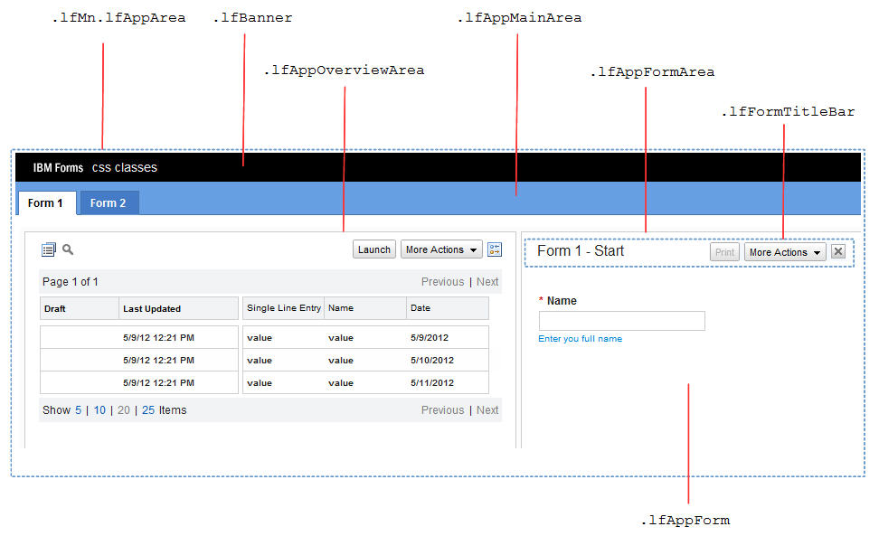
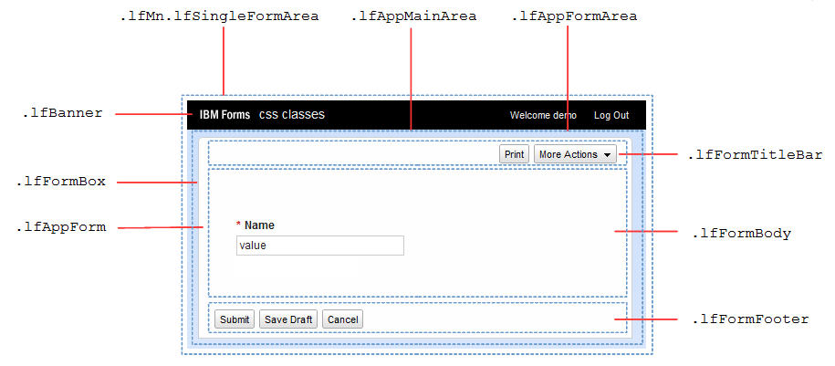
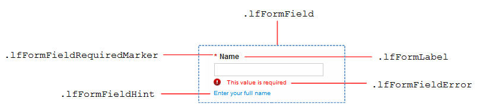
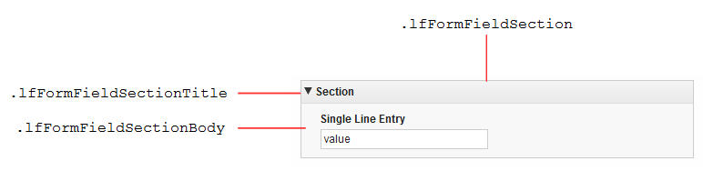
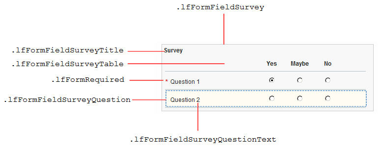
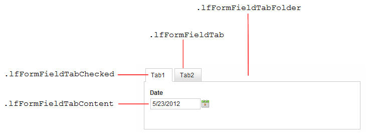
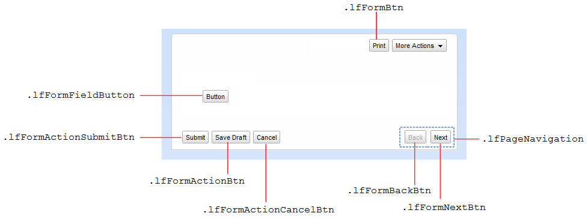
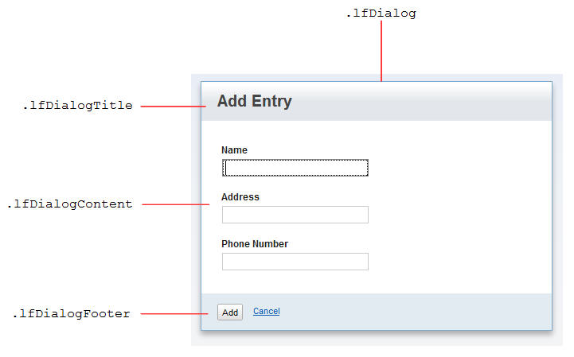

# Creating customized Cascading Style Sheets {#customizedcascadingstylesheets .reference}

You can apply your own custom Cascading Style Sheet \(CSS\) to the rendering of your HCL Leap application. To create a custom theme, you must be familiar with the basic concepts of CSS.

Elements are assigned specific class names, prefaced by lf in the custom theme. The following code is an example of a Leap custom theme.

```
/* Form - centered with a drop shadow*/
.lfMn .lfAppFormArea .lfFormBox {
   -moz-box-shadow: 5px 5px 12px #AEA4A4;
   -webkit-box-shadow: 5px 5px 12px #AEA4A4;
   box-shadow: 5px 5px 12px #AEA4A4;
   margin-right: auto; 
   margin-left: auto; 
}


/* Text (item titles) - medium blue */
.lfMn .lfFormLabel {
   color: #094291 !important;
}


/* Section - title bar red background and white text */
.lfMn .lfFormFieldSectionTitle {
   background: #cd111f !important;
   color: white !important;
   font-size: 13px !important;
   font-weight: bold !important;
}
.lfMn .lfFormFieldSectionTitle .lfFormLabel {
   color: white !important;
}

/* Tabs - dark-blue background with white text */
.lfMn .lfFormFieldTabFolder .lfFormFieldTab {
   background:#1556a8;
   border-top-color:#666;
   border-right-color:#666;
   border-left-color:#666;
}
.lfMn .lfFormFieldTabFolder .lfFormFieldTab * {
   color: white;
}


/* Tabs (selected) - white background with black text */
.lfMn .lfFormFieldTabFolder .lfFormFieldTabChecked, 
.lfMn.lotusui .lfFormFieldTabFolder .lfFormFieldTabCheckedHover,
.lfMn.lotusui .lfFormFieldTabFolder .lfFormFieldTabCheckedError {
   background: white;
   border-top-color:#ccc;
   border-right-color:#ccc;
   border-left-color:#ccc;
}
.lfMn .lfFormFieldTabFolder .lfFormFieldTabChecked * {
   color: #222 !important;
}


/* Button (Submit) - light blue background */
.lfMn .lfFormBtn.lfFormActionSubmitBtn {
   font-size: 12px;
   background: #93bef3;
   border: 1px solid #222;
   font-weight: bold;
}
.lfMn .lfFormBtn.lfFormActionSubmitBtn * {
   font-weight: bold;	
}


/* Button (Page Navigation) - dark blue background with white text*/
.lfMn .lfPageNavigation .lfFormBtn {
   background: #1556a8 !important;
   border: 1px solid #222;
}
.lfMn .lfPageNavigation .lfFormBtn *, 
.lfMn .lfPageNavigation .lfFormBtn *
{
   color: white !important;
   font-weight: bold;
}
```

## Class Names { .section}

**View Data layout**

Class names for the View Data layout are:

-   .lfAppForm
-   .lfAppFormArea
-   .lfAppMainArea
-   .lfAppOverviewArea
-   .lfBanner
-   .lfFormTitleBar
-   .lfMn.lfAppArea

The following graphic shows where the class names for various parts of the **View Data** section are located.



**Single form launch layout**

Class names for the Single form launch layout are:

-   .lfAppForm
-   .lfAppFormArea
-   .lfAppMainArea
-   .lfBanner
-   .lfFormBody
-   .lfFormBox
-   .lfFormFooter
-   .lfFormTitleBar
-   .lfMn.lfSingleFormArea

The following graphic shows where the class names for various parts of the Single form launch layout are located.



**Form items - general**

General class names are:

-   .lfFormField
-   .lfFormFieldError
-   .lfFormFieldHint
-   .lfFormFieldRequiredMarker
-   .lfFormLabel

The following graphic shows where the class names for general form items are located.



In addition to the general lfFormField class, each form item has a unique class name:

-   Attachment – lfFormFieldAttachment
-   Button – lfFormFieldButton
-   Check box – lfFormFieldCheckBox
-   Choice Slider - lfFormFieldChoiceSlider
-   Currency – lfFormFieldCurrency
-   Date – lfFormFieldDate
-   Drop-down – lfFormFieldDropDown
-   Email – lfFormFieldEmail
-   HTML fragment – lfFormFieldHTML
-   Image – lfFormFieldImage
-   Line – lfFormFieldHorizontalLine
-   Media – lfFormFieldMedia
-   Multi-line entry – lfFormFieldParagraph
-   Number – lfFormFieldNumber
-   Numeric Slider - lfFormFieldHorizontalSlider
-   Page navigator – lfFormFieldPageNavigator
-   Password – lfFormFieldPassword
-   Text – lfFormFieldRichText
-   Section – lfFormFieldSection
-   Select many – lfFormFieldSelectMany
-   Select one – lfFormFieldSelectOne
-   Single-line entry – lfFormFieldSingleLine
-   Survey – lfFormFieldSurvey
-   Tabbed folder – lfFormFieldTabFolder
-   Table – lfFormFieldTable
-   Time – lfFormFieldTime
-   Time stamp – lfFormFieldTimestamp
-   Web link – lfFormFieldStaticWeblink
-   Website – lfFormFieldWebSiteAddress

Required form items also have an extra lfFormFieldRequired class. The lfFormFieldInvalid class is added to form items that are invalid.

**Section**

Class names for Section are:

-   .lfFormFieldSection
-   .lfFormFieldSectionBody
-   .lfFormFieldSectionTitle

The following graphic shows where the class names used in creating a Section are located.



**Survey**

Class names for Survey are:

-   .lfFormFieldSurvey
-   .lfFormFieldSurveyQuestion
-   .lfFormFieldSurveyQuestionText
-   .lfFormFieldSurveyTable
-   .lfFormFieldSurveyTitle
-   .lfFormRequired

The following graphic shows where the class names used in creating a Survey are located.



**Tabbed Folder**

Class names for Tabbed Folder are:

-   .lfFormFieldTab
-   .lfFormFieldTabChecked
-   .lfFormFieldTabContent
-   .lfFormFieldTabFolder

The following graphic shows where the class names used in creating a Tabbed Folder are located.



**Buttons**

Class names for Buttons are:

-   .lfFormBtn
-   .lfFormActionBtn
-   .lfFormActionCancelBtn
-   .lfFormActionSubmitBtn
-   .lfFormBackBtn
-   .lfFormFieldButton
-   .lfFormNextBtn
-   .lfPageNavigation

The following graphic shows where the class names for creating buttons on a form are located.



**Dialogs**

Class names for Dialogs are:

-   .lfDialog
-   .lfDialogContent
-   .lfDialogFooter
-   .lfDialogTitle

The following graphic shows where the class names for creating dialog windows are located.



## Usage details { .section}

Your custom CSS is the last style sheet that is applied in an application. However, you must ensure that your CSS rules are more specific \(higher weighted\) than the ones already specified in the base CSS rules.

-   In some cases, you must append the !important declaration to your rules to override the Leap base rules. For example, to change the font color of all item titles use .lfMn .lfFormLabel \{color: \#094291 !important\}.
-   In some cases you must add the universal, “\*”, selector to your rules. For example, to change the font color of all buttons use .lfMn .lfFormBtn \* \{color: white\}

To reference image files that are contained within the same application, use a relative URL of ../image/.... For example, to reference the image named background.jpg contained within your application, use url\('../image/background.jpg'\). For more information about referencing image files within an application, see [Managing the files associated with your application](wf_managing_the_files_associated_with_your_appl.md)

**Note:** Pop-up menus and dialogs are direct childs of the main body, even when they appear to be otherwise. These child menus and dialogs must be styled to match the main body.

## Best Practices { .section}

There are no technical limitations to the CSS rules that can be applied to a form; however there are the following best practices:

-   All CSS rules must begin with the .lfMn class selector. This is important for forms that might be shown within the context of another web page, such as in the IBM® WebSphere® Portal environment.
-   Base your CSS rules around class names that are prefixed with “lf”. For example: lfFormFieldSingleLine. These class names that are likely to remain consistent between Leap releases.
-   Your custom styles are not restricted, so you must be specific with your selectors. Selectors that are too broad affect all aspects of theLeap interface, including all dialogs and all elements within the **View Data** interface.
-   Your CSS must target the browsers that are supported by Leap.
-   If possible, avoid CSS rules that affect the size and positioning of elements. You might want to specify some custom padding and margins, but it is your responsibility to ensure that no erroneous cropping or extra scroll-bars are displayed. We recommend that you limit your theme to the following properties:
    -   background color
    -   background image – typically for background gradients
    -   color
    -   font
    -   font size
    -   border – typically none or one pixel width

## Styling individual form items { .section}

Each item on the form is assigned a unique class name. The syntax for this class name is <form id\>-<page id\>-<item id\>. For example, a class name of F\_Form1-P\_Page1-F\_EmailAddress is applied to the item with an ID of **F\_EmailAddress**, on the page with an ID of **P\_Page1**, on the form with an ID of **F\_Form1**. You can use these unique class names to style specific items in your application.

**Note:** It is possible that two separate applications each have an item with the same unique class name.

## Using custom CSS class names { .section}

You can assign a custom CSS class name to any form, page, item, or stage action button in your application. You can then use the custom CSS class names in your custom theme. Setting custom CSS class names is done in the Properties side panel. Specify the custom class names, which are separated by spaces, in the **Custom CSS class names** field. Custom class names can also be added to, or removed from, items dynamically with the JavaScript™ API.

## Testing your custom CSS changes { .section}

Use a CSS development tool to test your custom CSS changes. Most web browsers contain such a tool, which you can use to discover the wanted styling class. You can even make CSS rule modifications online, so you immediately see how a change affects the form visually. After the rules are determined, copy them to your custom CSS file for uploading into your Leap application.

If you do not have access to a CSS development tool, an alternative approach is to place the CSS file on a web server. Reference the web location when you add the CSS file to your Leap application. You can modify the CSS file on the web server, then refresh the Leap application to pick up the changes. This approach quickly tests style changes without requiring you to repeatedly upload a new CSS file into your application, save the application, and then redeploy.

**Parent topic:**[Reference](reference_toc.md)

