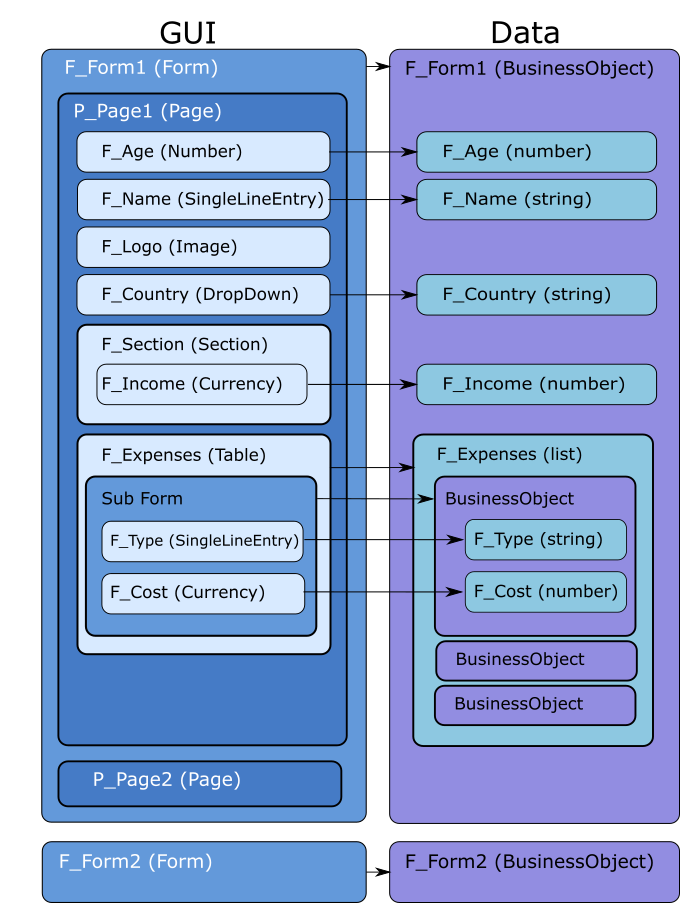

# JavaScript API {#ref_jsapi .reference}

## JavaScript™ API Structure { .section}

Leap JavaScript API structure.



The graphic provides a high-level view of the JavaScript API object structure at run time. The Form interface is created once when the application is loaded into the browser, and is then reused every time form data needs to be displayed. The Form Data Business Object is dynamic and is loaded into the user interface each time a form is loaded or created.

**Usage Details:**

-   This library follows a security protocol as defined in [Securing Leap overview](se_security_toc.md).
-   For applications with multiple forms, only the form user interface displayed has a Business Object assigned to it. The other forms are hidden, and do not point to data.
-   Tables point to a data element that is a list of Business Object data instances. These Business Object elements are of the same structure as the Business Objects used for a full form. The sub form that you create for editing the table data works only on one item in this list at a time. When it is not in use, it is hidden and does not point to any data.

## Interface Model { .section}

Application
:   The application is the parent that contains forms. It provides a few useful general functions and can be used to get access to any of the forms. Although you can get access to all the forms, only the form currently being displayed has a data Business Object and can have its user interface modified.

Forms
:   There can be any number of forms in an application. Each form contains one or more pages that contain the items. There is a Business Object for each form that holds the data contained in the form.

Pages
:   Pages contain items that collect and display the information for the form. All items on a page can be accessed as properties directly on the page, for example, page.F\_MySingleLineitem.setVisible\(false\);. Each item is accessed by its ID, which can be found in the composer by opening the item’s **Edit Properties** dialog and going to the **Advanced** tab.

Items
:   There are two types of items on a form: those that collect data, for example, Single Line Field and Timestamp, and those that do not, including Image, Text, and Section. Any item that collects data is associated with a Business Object Attribute that contains this data.

## Data Model { .section}

Business Object
:   The Business Object contains all the data for a particular form. This data is contained in a Business Object Attribute for each data item contained in the form. These options can be accessed using the following syntax:

    ```
    BO.F_MySingleLineitem
    ```

    Each Business Object Attribute is accessed by its ID, which is found in the composer by opening the item’s **Edit Properties** dialog and going to the **Advanced** tab.

Business Object Attribute
:   Each item that is mapped to data has its own Business Object Attribute. The Business Object Attribute contains this data.

    **Note:** Some items do not collect data. These items do not have a corresponding Business Object Attributes in the Business Object. For example: PageNavigation.

-   **[Running Custom JavaScript – Events](ref_jsapi_running_custom_js_events.md)**  
Custom JavaScript is run in response to events in the form. These events can be triggered at the application, form, page, and item level in response to form lifecycle changes, and to user interactions. A list of the events available, and how to interact with the form using them is shown in the following list.
-   **[Running Custom JavaScript Files](ref_jsapi_running_external_js_files.md)**  
Custom JavaScript can also be loaded from attached JavaScript files. Any .js file that is added to the application in the **Settings** \> **Files** section is automatically loaded into your running application. An associated JavaScript file is evaluated once when the browser first loads the running application, and is not called in response to any events.
-   **[Reference Objects and Functions](ref_jsapi_objects_and_functions.md)**  
 Describes the Functions available on different parts of the HCL Leap object model.

**Parent topic: **[Reference](reference_toc.md)

