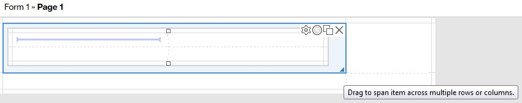

# Building a survey with Leap {#buildingasurveyapplication .learningContent}

This tutorial contains two sections.

In the first section, Opening Leap and building a form, learn how to:

-   Open a new application
-   Add form items to the form
-   Resize form items
-   Edit the properties of a form item
-   Set a rule so form items are hidden or visible on the form
-   Make form items mandatory
-   Redirect users after form submission
-   Save the form
-   Preview a form during the design phase

In the second section, Application Management, learn how to:

-   Deploy an application
-   Launch an application
-   Enter sample data into the application
-   Review the submitted sample data
-   Delete submitted sample data

The scenario: The coffee services in your office are not ideal. Every morning in the break room, you hear coworkers complain about the coffee, but nothing is being done to improve the coffee at work. Your Office Manager asks you to find out how your coworkers would like the coffee services changed. You must poll everyone in the office to get their opinions.

Your options:

Email
:   Send out an email to all your coworkers and ask them to provide their opinions on the coffee and how it can be improved. If you send out a mass email, sporadic responses from people arrive throughout the day, cluttering up your inbox. You must then take the feedback from the emails and collate it in a spreadsheet program, and there is no easy way to track who did not answer.

Create a survey
:   Create a survey form in Leap. You email the survey link to your coworkers, and they go online to provide you with feedback. All results are stored in a database and are easy to review and sort, and your email inbox is not filled with the sporadic responses.

Creating a survey is the option that you select.

**Note:** Throughout the Leap documentation, the words “form” and “application” are both used to describe the output that is created by Leap. Forms are a single page, or collection of pages, that create the user interface with which people interact. When a form is combined with workflow, presentation logic and other elements of the Leap technology, it becomes an application. Applications gather information that is submitted by users when they complete the form, and automatically store the submissions in a database.

Estimated time that is required to complete this module: 50 - 60 minutes

## Opening Leap and building a form {#lesson11}

The following steps describe how to open a new Leap application and build a form.

You want your coffee feedback to have:

-   An area that contains the title of the form, and a description of the purpose of the form. Include the amount of time that is needed to complete the form.
-   An area that contains the name of the submitter. Also included in this area if the form is the basic question: "Do you drink the coffee that is brewed in the office?"
-   An area that contains the survey questions.

Creating an application – When you start Leap, a screen is displayed with two tabs on the Forms toolbar: Use and Manage. The Use tab displays a list of all applications that are created by other users to which you have access. The Manage tab is where you create and manage applications.

1.  Click New Application.

2.  Enter a descriptive Application Name and Application Description, and select Create.

    A blank form with a two-by-two grid is displayed. The grid automatically aligns form items with one another when you place them on the form, and expands as you add form items. You can add and delete columns and rows as needed by clicking the border bar surrounding the grid.

    **Note:** As you add sections and form items to the form, the grid automatically expands to include the additional form items. You can add extra rows to your form manually, but it is not required. If there are empty rows or columns in a completed form, they are not displayed when the form is previewed or deployed.

3.  When you design forms, there are two ways to add form items to your form:

    -   You can drag form items from the Palette onto the form
    -   You can select a location on the grid, then click a form item. The form item is placed into the grid location.
    You can build forms by placing form items directly on the form or grouping form items in Sections. For our coffee feedback form, we use Sections to organize the form items. Sections are useful for the following reasons:

    -   They group form items in a way that is easy for the user to understand. When the form is viewed, the sections have specific background colors that are based on the style that is applied to the form.
    -   They make applying complex form functionality easier. For example, our form has a rule to hide the survey until the user selects a specific option. Instead of setting the rule on every form item individually, the rule is on the section. The rule applies to every form item within the section.
    -   They allow the form designer, and the form user, to collapse and expand entire parts of the form. In longer forms, collapsing sections is useful, as it keeps the form submitter from being overwhelmed by too much information.
    -   If you finish building your form and decide to change the layout, moving sections of form items is much easier than moving each form item individually.
    Creating the general information area: The general information area contains the title of the survey, more information for the form submitter, and an estimated time for completion.

4.  Drag a Section onto the form. The Section is placed into the grid area, and is highlighted to show the section has focus.

    Notice that the Section contains a grid within it. Form items for a section are added to the grid of the section.

5.  Click the field spanning handle and drag it to extend the section over both columns.

    You can resize any form item to span across multiple rows or columns.

    

6.  Click a grid box, then select Image from the Palette.

    The image form item is added to the form. You can edit many form items directly on the form, but others require you to use the Properties side panel. To display the list of available options for any form item, click the item on the canvas. The Properties side panel opens.

    1.  Click Add file, then Browse to locate the logo of your company. If you do not have a logo, browse to a small resolution image on your computer.

    2.  Click Open to select the image, and OK to close the Add File or URL Link window.

        The image is added to the form.

7.  Add a Text item to the Image.

    This text item contains the name of the survey.

    1.  In the Size menu, set the font size to Large, then and Bold. Type Workplace Coffee Feedback and click OK.

        The formatted text is inserted into the form.

        **Note:** You can adjust the spacing between form items by dragging the slider in the border bar. The mouse changes to a slider, and you can adjust the proportions of the form items.

8.  Add another Text item with the image. Using the field spanning handle, drag the form item to span both columns.

    1.  Enter the following text: We’d like your feedback on coffee services in the office. Complete the survey to provide your feedback. Time to complete survey: 3 minutes or less.

    2.  Click OK to add the text to the form.

9.  Save the form, either by pressing Ctrl + S, or by clicking the Save icon.

10. Creating the primary information area: Now, create the section that collects the name of the submitter, and asks the basic question of “Do you drink the office coffee?” You want to have 100% participation, but not everyone in the office might drink coffee. By allowing users to submit the survey with a negative response, you receive a complete set of data. Set a rule on the survey section to ask coffee-relevant questions only if the submitter indicates that they drink the office coffee.

11. Add another Section to the form.

    1.  Click the field spanning handle and drag it to extend the section over both columns.

12. Click a grid box, then click Single Line Entry.

    The Single Line Entry is placed onto the form. Edit the title of the Single Line Entry directly on the form.

    1.  Click the title of the item: “Single Line Entry”. The text is highlighted, and is now editable. Change the text to read: Your Name.

    2.  Click Add hint... and type “Enter your given name and surname.”

        The hint is displayed directly on the form.

        **Tip:** Adding information to the hint fields gives more information that helps the user complete your form. For example, in this form, you ask for the user name. The hint helps clarify whether you want given name and surname, given name only, or given , middle, and surname. You can also provide more clarification for users by inserting place holder text into each Single Line Entry item. Place holder text is available in the Properties side panel, and is available for any form item where the user must type information. For example, Single Line, Multi-Line, Currency, Number, and Email.

    3.  In the Single Line Entry on the canvas, click the box that is labeled Click to set as required.

        Users must complete this field to submit the form.

13. Select Select One from the Palette and put it in a grid area with the Your Name text item.

    The Properties side panel opens.

    1.  Change the Title: to Do you drink the office coffee?

    2.  Click the Required check box to make this question mandatory.

    3.  In the Options: section, one option is automatically available. To add another option, click the Add option plus sign. Set the options to:

        -   Yes
        -   No, I drink other hot beverages.
        -   No, I don’t drink hot beverages.
        Displayed Value and Saved Value – When you use any form item that has Set Options, two fields are displayed: Displayed Value and Saved value. As you type in the Displayed Value, the Saved Value is automatically updated with the same value. There are some cases where the Saved Value differs from the Displayed Value. For example, our Displayed Value questions are long. If you export the data from a Leap application to a spreadsheet, the selected answers are truncated and the data might be difficult to interpret. If you change the Saved Values of the three questions to “Yes”, “Other”, and “No”, or assign numerical values, the results are easier to understand.

    4.  Click OK.

14. Save your form and preview it.

    The Preview icon is located with the Save icon.

    **Note:** Ensure that your browser does not block pop-up windows, as the preview form opens in a new window or new tab, depending on your browser settings.

    Notice that the Submit and Cancel buttons are automatically added for you. While you can enter data into the form in Preview mode, you cannot submit a form until it is deployed.

15. To return to building the form, close the tab or the browser window in which the preview opened.

    Creating the survey: Now create the section which contains the survey questions. This section has a rule set on it, so if the user selects “No, I drink other hot beverages” or “No, I don’t drink hot beverages”, the survey is not displayed. First create the rule, then add the survey to the section.

16. Click the border bar to access the row action menu. Select Insert Row \(after\).

17. Click Section from the Palette, then click the form. Extend the section over both columns.

18. Click the Rules icon.

    The Rules window opens.

    1.  Click Add Rule.

    2.  In the When this is true: section, select Do you drink coffee?.

    3.  Set the operation to Does not equal.

    4.  Leave A fixed value in the next menu and select Yes.

    5.  In the Perform this action section, select Survey in the first menu.

        As you build the rule, it is automatic error checking is performed. If there is an error in the logic, either a warning sign or an error sign is displayed. As this rule contains no errors, a verification icon is displayed.

    6.  Select Hide in the second menu.

    7.  Click Apply and Close to save your changes and close the Rules window.

        The rule is now set so when a user responds that they don't drink coffee, they are not shown the survey about what type of coffee they prefer.

19. Now that the rule is set, add the survey questions using:

    -   Two Survey form items: one to ask what roast of coffee the employees prefer, the other to ask them questions about the coffee provided.
    -   A Select Many form item to provide more information about what they like or dislike about the coffee.
    -   A Multi-Line Entry form item to provide detailed comments.
20. Select Survey from the Palette and add it to the section grid. Extend the survey over both columns.

    1.  Set the following properties in the side panel:

        -   Title: – Coffee preference
        -   Hint: – What type of coffee roast do you prefer?
        -   Options:
            -   Dark Roast
            -   Medium Roast
            -   Light Roast
            -   Decaf
    2.  Click OK.

    3.  Change the survey question from the default “Click to edit” to I prefer to drink:

21. Select Survey from the Palette and add it with the Coffee preference survey. Extend the survey over both columns.

    1.  In the Properties panel, set the following properties:

        -   Title: – Please rank each question:
        -   Options:

            |Displayed Value|Saved Value|
            |---------------|:----------|
            |Totally agree|5|
            |Somewhat agree|4|
            |Agree|3|
            |No opinion|0|
            |Somewhat disagree|2|
            |Totally disagree|1|

        If you export the data to a spreadsheet program, each user’s response displays as the numerical code, rather than the Displayed Value. Tabulation of results is easier as you can sort the submitted responses by Saved Value numerical indicator.

    2.  Review the ranking labels.

        Ranking labels are displayed before and after the Displayed Value. Set the following properties:

        -   Select Display before and after labels.
        -   In the Before label: text box, typeAgree.
        -   In the After label: text box, typeDisagree.
    3.  Change the survey question from the default “Click to edit” to: I like the coffee at work.

    4.  Click Add question to add another row to the survey. Change the survey question to: If changes were made, I would drink more coffee.

        You can repeat this step to add more questions to the survey.

22. An alternative to multiple survey questions is to add a Select Many form item where users can select multiple choices from a list.

23. Click Select Many from the Palette and place it onto the form near the survey. Extend the Select Many form item over both columns.

    The properties panel opens.

    1.  **Note:** You can change the orientation of the Select Many choices by changing the Choice Layout. Changes are made instantly on the form. You can also select a minimum and maximum number of choices the user can select.

        Set the following properties:

        -   Title: – I find the coffee in the office:
        -   Hint: – Select all that apply.
        -   Options:
            -   Too acidic
            -   Too bitter
            -   Too weak
            -   Too strong
            -   Goes cold too quickly
            -   Too gritty
            -   Perfect. No changes required.
        For example, you can require the user to select a minimum of two choices and a maximum of 5.

    2.  Click OK.

24. Save the form.

25. To complete the survey form, add a Multi-Line Entry so users can submit other options, or opinions.

26. Click Multi-Line Entry from the Palette and place it onto the form with the Select Many form item. Extend the Multi-Line Entry form item over both columns.

    The properties panel opens.

    1.  Set the following properties:

        -   Title: – Please enter any specific suggestions you might have:
        -   Width: – Full width. Selecting Full width results in the space for entering data automatically adjusting to the size of the form in the browser window.
        -   Hint: – For example, a specific bean blend you’d like us to try.
    2.  Click OK.

27. The functionality of the survey is now in place. When users complete the survey and submit it, they receive a visual confirmation on the screen that the survey is submitted, and by default, are shown the survey again. To prevent user confusion, and to prevent the user from submitting the form again, redirect the user to your company website after the form is submitted.

    Adding a redirect URL is done in the Workflow tab. By default, each form automatically has a Start stage and a Submitted stage. The Start stage contains the Submit and Cancel buttons that are seen when you preview the form.

28. Click the Workflow tab.

    1.  Click the Submit button node.

        The Properties panel opens. The Action Completion Message: has “Your data has been successfully submitted.” as the default message. You can leave the default, or change the text.

    2.  In the Action Completion Redirect URL \(optional\): text entry area, enter the URL of your company website.

29. Click the Design tab to return to the main body of the form.

    The coffee survey is now complete. Save and preview the form.

Now that you have built a form, you must deploy it so it is available for users.

## Application management {#lesson12}

The following steps describe how to deploy a completed form, launch a form, enter sample data, review the submitted sample data, then delete the submitted sample data.

Deploying an application – Deploying, or publishing forms is done in the Manage tab.

1.  Click the Manage tab.

2.  Click the Deploy link for your survey.

    The Deployment Settings window is displayed.

3.  Select Set deployment Period. Set the Start and Stop dates to span a two week window, starting today.

    **Tip:** It is useful to have a start and end date for some applications because users are forced to complete the form within a specific time frame.

4.  Click Start.

    The application is deployed.

    After the application is deployed, you need the URL to provide to your colleagues so they can complete the survey. There are two ways to get the URL:

    -   Click the Launch link. A browser window launches with the URL of the deployed form in the address bar. Notice that the Submit button on the end of the form is now available.
    -   Expand the information for the Coffee Feedback application by clicking the Show application details button for application. The link is provided on the screen in the URL Links section. Copy the URL for distribution to your coworkers.
5.  Updating an application after deployment – You can change an application at any time. However, you must deploy the application again for users to see your changes. There are two ways to change a deployed application: Update the deployed application, or stop the deployment, and then redeploy.

6.  To update a deployed application, in the Manage tab click the Edit link.

    A message is displayed to warn you that changing an application after it is deployed can affect previously collected data.

    1.  Click Yes on the warning message.

        The form opens and is available for editing.

    2.  Make the required changes to the form. Save the form again.

    3.  Click the Manage tab, then click the Deploy link.

    4.  Click Update.

        The application is redeployed with the updated form.

7.  You can also stop the deployment manually, make changes, then redeploy the application. If a deployment is stopped, the application is no longer available online.
8.  To stop a deployed application, click the Deploy link.

    The Deployment Settings window opens

    1.  Click Stop.

        **Note:** If a user is completing the form when you stop, redeploy, or update an application, they receive an error message. The unsubmitted data is lost and the user must fill the form in again.

9.  Adding sample data to an application – Now that the form is complete and deployed, add some sample data.
10. Click the Launch link.

    The application opens in a new browser window.

11. Submit the form several times with various sample data.

    Here are some examples to try, but you can use your own combination of survey results.

    -   John Smith who drinks the office coffee. He prefers dark roast, and does not enjoy the office coffee because it is too weak and cold.
    -   Mary Jones who drinks only tea.
    -   Sam Wesson who drinks the office coffee. He likes a medium roast and like the coffee the way it is. He would like management to try a different roast combination by a local roast house.
    -   Ellen Steele who drinks the coffee, but prefers decaffeinated coffee. She would like the coffee to be weaker.
    **Note:** As you submit each survey, you see a message upon completion, and then are redirected to the company website.

12. Viewing submitted data – After the sample data is added, return to Leap to review the submitted data.
13. In the Manage tab, click the View Data link.

    The View Data screen is displayed in either a new tab or a new browser window, depending on your browser settings. On the View Data page, all submitted responses are summarized in a chart.

14. Click Sam Wesson’s name.

    His submitted form is displayed in the Application view.

15. Deleting sample data – Now that you tested the form, it is highly recommended that you delete all sample responses to avoid interference with the actual data from your coworkers. There are two ways to delete the sample data:

    -   Delete individual entries from the View Data screen
    -   Update the deployment to delete previous records.
16. To delete submitted data from the View Data screen:

    1.  Select a sample record from the list so it is displayed in the Application view window.

        If the form is wider than the allotted screen space, scroll bars are displayed.

    2.  Click Delete Record in the Application view window.

        **Note:** Clicking the x in that window closes the record, but does not delete it.

17. To delete submitted data by updating the deployment:

    1.  Close the View Data tab or browser window.

        You are on the Leap Manage screen.

    2.  Click Deploy.

        The Deployment Settings window opens.

    3.  Click the Advanced tab.

    4.  Select the check box for Delete previous submissions. You are asked to confirm the deletion of the submitted data. Click OK.

    5.  Click Update.

    6.  Click the View Data link.

        The blank View Data page is displayed.

The survey form is complete and ready to send to your coworkers. You can send out the survey link in an office-wide email. After two weeks, the survey deployment period ends, and you provide the survey results to the Office Manager.

**Parent topic:**[Building a Survey application](tut_survey_application_OV.md)

