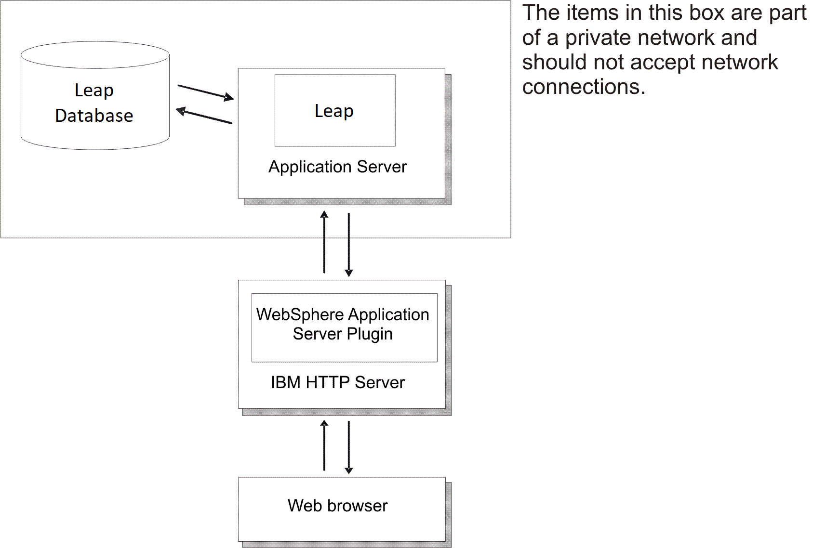
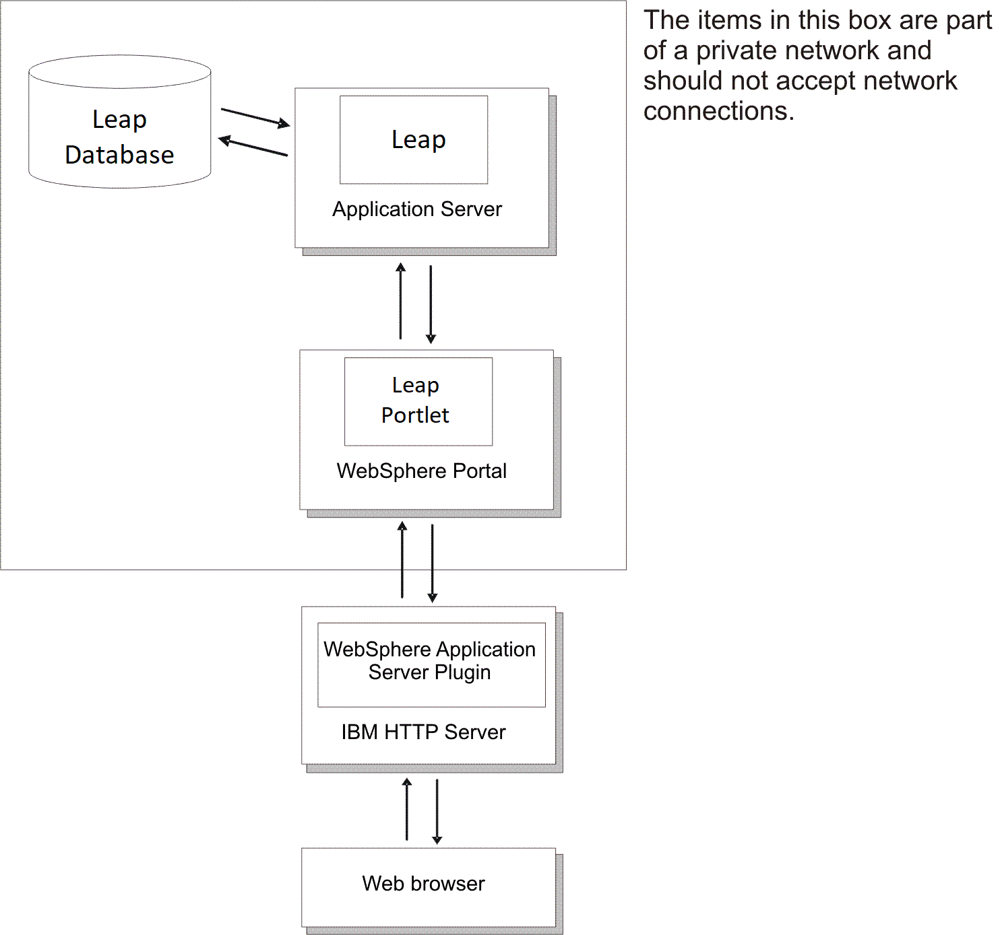

# Basic Architecture {#feb_basic_architecture .concept}

Leap relies on two central components: the application server and the database.

Leap relies on two central components: the application server and the database. The following diagram shows how these components are set up in a typical installation:

The components perform the following functions:

-   **Leap**: The environment in which you create, deploy and launch applications.
-   **IBM HTTP Server**: A standard component of WebSphere® Application Server that interacts with the application server.
-   **Leap Database**: The Leap database which contains all applications and data that exist within the Leap environment.

If you plan to use Leap with WebSphere Portal, the following diagram describes the basic architecture:

The components perform the following functions:

-   **Leap**: The environment in which you create, deploy and launch applications.
-   **IBM HTTP Server**: A standard component of WebSphere Application Server that interacts with the application server.
-   **Leap Database**: The Leap database which contains all applications and data that exist within the Leap environment.
-   **Leap Portlet:** When installed and configured to point at the Leap server, it enables content to be rendered within a WebSphere Portal environment.
-   **User registry**: Leap relies on a user registry, such as an LDAP, to manage access to the system. This is connected to the Leap application server. For more information on supported user registries, see Leap [system requirements](https://support.hcltechsw.com/csm?id=kb_article&sysparm_article=KB0010574).

    **Note:** The detailed system requirements page displays Leap 8.6.0 requirements. In the upper left corner of the page, there is a menu from which you can select version 9.3.

-   **Email server**: Leap can optionally send emails when configured with a proper email relay.

**Parent topic: **[Deploying to a traditional platform](deploytraditional_leap.md)

**Related information**  

[Manually deploying to WebSphere Application Server](in_deploying_was.md)

