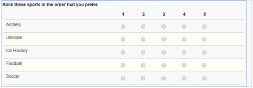

# Sample Functions

This page is a collection of sample javascript functions that could be used in your Leap applications.

**Note:** these functions were collected from the community and you may need to modify them when implementing in your Leap application.

## Date Field Functions

### Add hours to timestamp

Add number of hours to a timestamp

**Function:**
```javascript
// dateObj1 - The date field (i.e. BO.F_Date)
// numOfHours - The number of hours to add
app.getSharedData().addHoursToDate = function(dateObj1, numOfHours) {
    var d1 = dateObj1.getValue(); //get first date
 
    var d1_milli = d1.getTime();
    return new Date(Math.ceil(d1_milli + (1000 * 60 * 60 * numOfHours)));
}
```

### Add days to date

Add number of days to a date. 

**Usage:**

Place the function in the Settings...Events...Custom actions.  In the field where you enter the date or the number of days to add you place: 

```javascript
app.getSharedData().addDaysToDate(BO.F_Date, 90);
```

You can either hard-code the number of days to add or have the value come from a field.

**Function:**
```javascript
// dateObj1 - The date field (i.e. BO.F_Date)
// numOfDays - The number of days to add
app.getSharedData().addDaysToDate = function(dateObj1, numOfDays) {
    var d1 = dateObj1.getValue(); //get first date
 
    var d1_milli = d1.getTime();
    return new Date(Math.ceil(d1_milli + (1000 * 60 * 60 * 24 * numOfDays)));
}
```


### Add working days to date

This function will return a new date with the number of specified working days added, it will not include weekends when determining the final date.  You will need to set that returned date into your desired field.

A n additional function was added to determine if a day was a registered holiday.

**Usage:**

Place the function in the Settings...Events...Custom actions.  In the field where you enter the date or the number of days to add.

You can either hard-code the number of days to add:

```javascript
app.getSharedData().addWorkingDaysToDate(BO.F_Date, 90);
```

or have the value come from a field.

```javascript
app.getSharedData().addWorkingDaysToDate(BO.F_Date, BO.F_Number.getValue());
```

To set another field with the result:

```javascript
BO.F_newDate.setValue(app.getSharedData().addWorkingDaysToDate(BO.F_Date, 90));
```

**Function:**

```javascript
app.getSharedData().isHoliday = function(d) {
  var r = false;
  var holidays = ["01-01","02-18","04-19","05-20","08-05","09-02"]; //set your holidays
 
  //check if any of the days is a holiday
  for(var holiday in holidays) {
    var h = new Date(get(holidays, holiday)+"-2020");
 
    if(d.getMonth() == h.getMonth() && d.getDay() == h.getDay()) {
      r = true;
    }
  }
  return r;
}
 
// dateObj1 - The date field (i.e. BO.F_Date)
// numOfDays - The number of working days to add
app.getSharedData().addWorkingDaysToDate = function(dateObj1, numOfDays) {
 
  var sd = dateObj1.getValue(); //get first date
  var ed = dateObj1.getValue();
  var counter = numOfDays;
  var millisecondsPerDay = 86400 * 1000;
  while (counter > 0) {
    ed = new Date(Math.ceil(ed.getTime() + millisecondsPerDay));
    var theDay = ed.getDay();

    // don't count sat and sunday and holidays
    if(theDay !== 0 && theDay !==6 && !app.getSharedData().isHoliday(ed)) {
        counter--;
    }   
  }

  return ed;   
}
```


### Calculate age from birth date

Calculates the age from a specified birth date.

**Usage:**

Place function in Settings...Events...Custom Actions
```javascript
BO.F_Number.setValue(app.getSharedData().getAgeFromBirthDate(BOA.getValue(), true)); 
BO.F_SingleLine.setValue(app.getSharedData().getAgeFromBirthDate(BOA.getValue(), false));
```

**Function:**
```javascript
// birthDay - the date to calculate the age from
app.getSharedData().getAgeFromBirthDate = function(birthDay) {   
  // 1557600000 is 24 * 3600 * 365.25 * 1000 Which is the length of a year
  // the length of a year is 365 days and 6 hours which is 0.25 day.
  // double tilde converts float to integer
  return ~~((Date.now() - birthDay) / (31557600000));
}
```


### Calculate working days between days

Returns the number of calendar days between the two dates specified.  The function expects to receive date objects, not strings.

**Usage:**

Copy the function to the Settings...Events...onStart section of your application.

```javascript
const holidays = ["01-01-2024","02-18-2024","04-19-2024","05-20-2024","08-05-2024","09-02-2024", "12-25-2024"];
app.getSharedData().includesHoliday = function (startDt, endDt, holidays) {
   
  var r = false;
 
  for(var holiday in holidays) {
    var h = new Date(get(holidays, holiday));
 
    if(h.getTime() >= startDt.getTime() && h.getTime() <= endDt.getTime()) {
      r = true;
    }
  }
  return r;
}
 
// includeWeekends - Pass true if you want to include weekends otherwise false.
app.getSharedData().workingDaysBetweenDates = function(startDt, endDt, includeWeekends) {
  // Validate input
  if (endDt < startDt)
    return 0;

  // Calculate days between dates
  var millisecondsPerDay = 86400 * 1000; // Day in milliseconds
  startDt.setHours(0,0,0,1);  // Start just after midnight
  endDt.setHours(23,59,59,999);  // End just before midnight
  var diff = endDt.getTime() - startDt.getTime();  // Milliseconds between datetime objects    
  var days = Math.ceil(diff / millisecondsPerDay);   

  if(!includeWeekends) {
    // Subtract two weekend days for every week in between
    var weeks = Math.floor(days / 7);
    var days = days - (weeks * 2);

    // Handle special cases
    var startDay = startDt.getDay();
    var endDay = endDt.getDay();

    // Remove weekend not previously removed.   
    if (startDay - endDay > 1) {       
      days = days - 2;     
    }

    // Remove start day if span starts on Sunday but ends before Saturday
    if (startDay === 0 && endDay !== 6) {
      days = days - 1;
    }

    // Remove end day if span ends on Saturday but starts after Sunday
    if (endDay === 6 && startDay !== 0) {
      days = days - 1; 
    }

    //subtract for any holiday included in the span
    if(app.getSharedData().includesHoliday(startDt, endDt)) {
      days = days - 1;
    }
  }
  return days;
}
```


### Compare date fields

Given two dates the function will validate that they are numOfDays days apart.  If the dateObj2 is not numOfDays days greater than dateObj1 then dateObj2 will be set invalid with the specified errorMsg.

**Usage:**

Copy the function to the Settings...Events...onStart section of your application.

```javascript
// dateObj1 - the first date field (e.g. BO.F_Date1)
// dateObj2 - the second date field (e.g. BO.F_Date2)
// numOfDays - the number of days that D2 must be grater than D1
// errorMsg - The error message to display for D2 when invalid
app.getSharedData().compareDatesByDays = function(dateObj1, dateObj2, numOfDays, errorMsg) {
 
var d1 = dateObj1.getValue(); //get first date
var d2 = dateObj2.getValue(); //get sec date
var diff = 0;
 
//convert to milliseconds
var d1_milli = d1.getTime();
var d2_milli = d2.getTime();
 
//get difference and convert back to days
var diff_milli = d2_milli - d1_milli;
var nDays = Math.ceil(diff_milli / 1000 / 60 / 60 / 24);
 
 //if the diff is less then numOfDays set the d2 field invalid
 if(nDays < numOfDays) {
    dateObj2.setValid(false, errorMsg);
  } else {
    dateObj2.setValid(true, "");
  }
}
```

Then in both of your date fields place this in the onItemChange event to
call the function (make sure you replace F_Date2 and F_Date3 with the IDs of your date fields):

```javascript
app.getSharedData().compareDatesByDays(BO.F_Date2, BO.F_Date3, 14, "The date must be 14 days past D1.");
```


### Convert AD date to Buddhist date

Convert a standard AD date into a Buddhist Date

**Usage:**

Place in *onLoad* or *beforeSubmit* event to convert a date.  The code would be something like:

```javascript
BO.F_DATETIME.setValue(app.getSharedData().convertToBuddhistDate(new Date()));
```

**Function:**
```javascript
// dateAD: the date to convert
app.getSharedData().convertToBuddhistDate = function(dateAD){
    var dateBE = new Date(dateAD);
    dateBE.setFullYear(dateAD.getFullYear() + 543);
    return dateBE;
}
```

### Get Days in Month

Given a date it will return the number of days in that month.

**Function:**
```javascript
app.getSharedData().daysInThisMonth = function( date ) {
 
  var calendarObj = new Array();
  
  calendarObj.push({month: 0, days: 31});
  calendarObj.push({month: 1, days: 28});
  calendarObj.push({month: 2, days: 31});
  calendarObj.push({month: 3, days: 30});
  calendarObj.push({month: 4, days: 31});
  calendarObj.push({month: 5, days: 30});
  calendarObj.push({month: 6, days: 31});
  calendarObj.push({month: 7, days: 31});
  calendarObj.push({month: 8, days: 30});
  calendarObj.push({month: 9, days: 31});
  calendarObj.push({month: 10, days: 30});
  calendarObj.push({month: 11, days: 31});
  
  // Get the "non-Leap Year" number of days in the current month.
  var month = date.getMonth(); // Returns [0-11]
  var days = get( calendarObj, month ).days;
  
  // Add one day to February, if this is a Leap Year.
  if( month === "1" && app.getSharedData().isLeapYear( date ) ) {
    days++;
  }
  
  return days;
}
```


### Get week number from date

Given the BO of a date field this function will return the week number the specified date is part of.

**Usage:**

Place the function in the onLoad event of the form where you want to use it.  Then in the *onItemChange* event of the date field where you want to get the week number.

```javascript
BO.F_weekNumber.setValue(app.getSharedData().getWeekNumberFromDate(BOA.getValue()));
```

**Function:**
```javascript
// theDt - the business object of the date field (i.e. BOA, BO.F_Date1)
app.getSharedData().getWeekNumberFromDate = function(theDt) {
  if(theDt !== "") {
  
    // Create a copy of this date object
    var t = new Date(theDt);
    
    // ISO week date weeks start on monday so correct the day number
    var dayNr = (t.getDay() + 6) % 7;
    
    // Set the target to the thursday of this week so the target date is in the right year
    t.setDate(t.getDate() - dayNr + 3);
    
    // ISO 8601 states that week 1 is the week with january 4th in it
    var jan4 = new Date(t.getFullYear(), 0, 4);
    
    // Number of days between target date and january 4th
    var dayDiff = (t - jan4) / 86400000;
    
    // Calculate week number: Week 1 (january 4th) plus the number of weeks between target date and january 4th
    var weekNr = 1 + Math.ceil(dayDiff / 7);
    return weekNr;
  } else {
    return "";
  }
}
```


### Subtract days from date

Subtract number of days from a date.

**Usage:**
 You might want to calculate a new date based on one that a user has entered by placing this code in the *onItemChange* event of the date field:
```javascript
BO.F_Date2.setValue(app.getSharedData().subtractDaysFromDate(BO.F_Date1, 15));
```

**Function:**
```javascript
// dateObj1 - The date field (i.e. BO.F_Date)
// numOfDays - The number of days to subtract
app.getSharedData().subtractDaysFromDate = function(dateObj1, numOfDays) {
  var d1 = dateObj1.getValue(); //get first date
  var d1_milli = d1.getTime();
  return new Date(Math.ceil(d1_milli - (1000 * 60 * 60 * 24 * numOfDays)));
}
```


### Subtract working days from date

Subtract number of working days (not incl Sat or Sun) from a date.

**Usage:**
 You might want to calculate a new date based on one that a user has entered by placing this code in the *onItemChange* event of the date field:
```javascript
BO.F_Date2.setValue(app.getSharedData().subtractWorkingDaysFromDate(BO.F_Date1, 15));
```

**Function:**
```javascript
// dateObj1 - The date field (i.e. BO.F_Date)
// numOfDays - The number of working days to subtract
app.getSharedData().subtractWorkingDaysFromDate = function(dateObj1, numOfDays) {
  var d1 = dateObj1.getValue(); //get first date
  var d2 = dateObj1.getValue();
  var counter = numOfDays;
  var millisecondsPerDay = 86400 * 1000;
  while (counter > 0) {
    d2 = new Date(Math.ceil(d2.getTime() - millisecondsPerDay));
    var theDay = d2.getDay();
    // don't count sat and sunday
    if(theDay !== 0 && theDay !==6) {
      counter--;
    }
  }
  return d2;    
}
```


### Verify entered date is after today

This function will set the date field to invalid if the entered date is not after today.

**Usage:** 

Copy the code to the Settings...Events...onStart section of your application.
```javascript
// dateObj1 - the business object of the date field (i.e. BOA, BO.F_Date1)
// errorMsg - The message to display to the user when the field is set to invalid
app.getSharedData().isDateAfterToday = function(dateObj1, errorMsg) {
 
  //get todays date, including the current time
  var today = new Date();       
  var d = dateObj1.getValue(); //get date from passed object
 
  //set the time of the date to just before midnight
  d.setSeconds(59);
  d.setMinutes(59);
  d.setHours(23);
 
  //D1 MUST be less then today
  if(d < today) {
    dateObj1.setValid(false, errorMsg);
  } else {
    dateObj1.setValid(true, "");
  }
}
```

You can use this function in the date field itself or elsewhere.  You could use this in the onItemChange event of the date field by: 
```javascript
app.getSharedData().isDateAfterToday(BOA, "The date must be after today.");
```

Or you could use this in a different event within a different item
```javascript
app.getSharedData().isDateAfterToday(BO.F_Date1, "The date must be after today.");
```

### Verify entered date is before today

This function will set the date field to invalid if the entered date is not after today.

**Usage:**

Copy the function to the Settings...Events...onStart section of your application.
```javascript
// dateObj1 - the business object of the date field (i.e. BOA, BO.F_Date1)
// errorMsg - The message to display to the user when the field is set to invalid
app.getSharedData().isDateAfterToday = function(dateObj1, errorMsg) {
  //get todays date, including the current time
  var today = new Date();       
  var d = dateObj1.getValue(); //get date from passed object
    
  //set the time of the date to just before midnight
  d.setSeconds(59);
  d.setMinutes(59);
  d.setHours(23);
 
  //D1 MUST be less then today
  if(d < today) {
    dateObj1.setValid(false, errorMsg);
  } else {
    dateObj1.setValid(true, "");
  }
}
```

You can use this function in the date field itself or elsewhere.  You could use this in the *onItemChange* event of the date field by:
```javascript
app.getSharedData().isDateAfterToday(BOA, "The date must be after today.");
```

Or you could use this in a different event within a different item:

```javascript
 app.getSharedData().isDateAfterToday(BO.F_Date1, "The date must be after today.");
```


## List Item Functions

### Get select many item title

Returns the displayed title of the select many selection.  You pass it the value.

**Usage:**

Then to use it you would call it in the onItemChange of the dropdown:
```javascript
var selectedItemTitle = app.getSharedData().getCheckListItemTitles(item, BOA.getValue());
```
Then you can do whatever you want with the selectedItemTitle, like set it into another field:
```javascript
BO.F_SingleLine.setValue(selectedItemTitle);
```

**Function:**
```javascript
app.getSharedData().getCheckListItemTitles = function(theList, compareValue) {
  //split the compareValue into all the selected item
  var selChecks = compareValue.split("__#__");
 
  //for each one, get the title from the list and create a new concatenation
  var opts = theList.getOptions();
  var retVal = "";
  for(var h=0;h<selChecks.length;h++) {
    var v = get(selChecks, h);

    //loop all the items and return if you find the compareValue
    for(var i=0;i<opts.length;i++) {               
      var theItemTitle = get(get(opts,i), 'title');
      var theItemValue = get(get(opts,i), 'value');

      if(theItemValue === v) {
        if (retVal !== "") {
          retVal += "__#__";
        }
        retVal += theItemTitle;
          break;
      }
    }
  }
  return retVal;
}
```

### Get dropdown title

When you are using an ID for the saved value of a drop down and you need to get at the actual title.

**Usage:**

Copy the code to the Settings...Events...onStart section of your application.

Then to use it you would call it in the onItemChange of the dropdown:
```javascript
 var selectedItemTitle = app.getSharedData().getDropdownItemTitle(item, BOA.getValue());
 ```

Then you can do whatever you want with the selectedItemTitle, like set it into another field:
```javascript
BO.F_SingleLine.setValue(selectedItemTitle);
```

**Function:**
```javascript
app.getSharedData().getDropdownItemTitle = function(theList, compareValue) {
  var opts = theList.getOptions();
  var retVal = "";
  
  //loop all the items and return if you find the compareValue
  for(var i=0;i<opts.length;i++) {
    var theItemBO = theList.getBOAttr();
    var theItemTitle = get(get(opts,i), 'title');
    var theItemValue = get(get(opts,i), 'value');
    
    if(theItemValue === theItemBO.getValue()) {
      retVal = theItemTitle;
      break;
    }
  }
  return retVal;
}
```


### Randomize list choices

**Usage:**

Copy the function in to the Application...onStart event.

In the event where you want to trigger the function place the code:
```javascript
app.getSharedData().randomizeList(page.F_DropDown);
app.getSharedData().randomizeList(form.getPage("P_NewPage1").F_DropDown);
```

**Function:**
```javascript
// Returns a random number between the numbers specified. */
app.getSharedData().randomFromInterval = function(from,to) {
  return Math.floor(Math.random()*(to-from+1)+from);
}
 
// Randomizes the selections of the specified list item.
app.getSharedData().randomizeList = function(theItem) {
  //store the current value
  var value = theItem.getBOAttr().getValue();
  
  //set up the arrays
  var arrOptions = theItem.getOptions();
  var tmpOptions = theItem.getOptions();
  var newOptions = new Array();
  
  //Randomize the list
  if(arrOptions !== null) {
    for ( var i = 0; i < arrOptions.length; i++ ) {
      //the random number should be between 0 and the length of the array
      var j = app.getSharedData().randomFromInterval(0,tmpOptions.length-1);
      var temp = get(tmpOptions, j);
      
      //assign the item to the new array
      newOptions.push(temp);
      
      //remove the item from the temp array
      tmpOptions.splice(j, 1);
    }
    
    //Set the options back
    theItem.setOptions(newOptions);
    //reset back to the current value
    theItem.getBOAttr().getValue(value);
  }
}
```


### Remove blank options from list

Returns a new List that does not contain the blank value.  Supports Select One, Select Many and Dropdown objects.

**Usage:**

Copy the code to the Settings...Events...onStart section of your application.

In the onShow event of the list object that you want to change call the function by doing something like:
```javascript
//get the dropdown options  
var c_opts = form.getPage('P_NewPage').F_DropDown.getOptions();
var n_opts = app.getSharedData().removeBlankFromList(opts);
form.getPage('P_NewPage').F_DropDown.setOptions(n_opts);
```
This gets the existing list options, passes it to the function which returns a new list.  That new list is then set into the list object.

**Function:**
```javascript
// theList - the List item from which to remove blank options
app.getSharedData().removeBlankFromList = function(theList) {
  //check all options for a blank value and remove it...
  var newList = new Array();
  //loop through the current list
  for(var j=0; j<theList.length;j++) {
      var curItem = get(theList, j);
      if(curItem !== "") {
          newList.push(curItem);
      }
  }
  return newList;
}
```

### Remove duplicates from list

This function will remove any duplicate options found the current set of options.

**Usage:**

Copy the code to the Settings...Events...onStart section of your application.

Then you need to decide where and when to call the function.  In the case of a service call you would want to call it when the service completes.  Which might look something like this:

```javascript
var service = form.getServiceConfiguration("SC_ServiceThatReturnsList");
  service.connectEvent('onCallFinished', function(success)
   {
    if(success) {          
       var cList = form.getPage('P_thePage').F_DropDown2.getOptions();
       var nList = app.getSharedData().removeDuplicatesFromList(cList);
       form.getPage('P_thePage').F_DropDown2.setOptions(nList);
    }
});
```

I would place this listener into the onLoad event of the form.  This technique works for dropdowns, check and radio lists.
If you wanted to do this for a table you would have to change the process slightly.

**Function:**
```javascript
app.getSharedData().removeDuplicatesFromList = function(theList) {
  var newList = new Array();
 
    //loop through the current list
  for(var j=0; j<theList.length;j++) {
    var curItem = get(theList, j);
    var itemFound = false;
 
    //loop through the newList checking to see if the item is there
    for(var k=0; k<newList.length;k++) {
      if(get(curItem, 'title') === get(get(newList, k), 'title')) {
        itemFound = true;
        break;
      }
    }
    if(!itemFound) {
      newList.push(curItem);
    }
  }
  return newList;
}
```


### Remove item from list

Removes the blank option from the list even if it is not the first, will also remove any duplicate blank options.

**Function:**
```javascript
//   theList - the List item from which to remove blank options
app.getSharedData().removeItemFromList = function(theList, theVal) {
 
  //check all options for a blank value and remove it...
  var newList = new Array();
 
 const validTypes = ["comboBox","radioGroup","checkGroup"];
  
  if(validTypes.indexOf(theList.getType()) !== -1) { 
    //loop through the current list
    var opts = theList.getOptions();
    for(var j=0; j<opts.length;j++) {
      var curItem = get(opts, j);
      if(get(curItem, 'title') !== theVal) {        
        newList.push(curItem);        
      }      
    }
  }
  theList.setOptions(newList);
}
```


### Remove items from list

Removes the options from the list that are found in the omitNames data passed to it.

**Usage:**
```javascript
const omit = ["red","green"];
app.getSharedData().removeItemsFromList(page.F_SelectMany1, omit);
```

**Function:**

```javascript
// theList - the List item from which to remove blank options
// omitNames - string of items to omit from the list
app.getSharedData().removeItemsFromList = function(theList, omitNames) {
 
  //check all options for a blank value and remove it...
  var newList = new Array();
  const validTypes = ["comboBox","radioGroup","checkGroup"];
  
  if(validTypes.indexOf(theList.getType()) !== -1) { 
    //loop through the current list
    var opts = theList.getOptions();
    for(var j=0; j<opts.length;j++) {
      var curItem = get(opts, j);

      if(typeof omitNames !== "undefined" && omitNames.indexOf(get(curItem, 'title')) === -1) {
        newList.push(curItem);
      }         
    }
  }
  theList.setOptions(newList);
}
```


## Table Item Functions

### Calculate sum of column A where column B meets specified criteria

Returns the sum of columnA for all the rows where columnB matches the specified entry.  For example: Sum all the 'currency fields' in the rows where dropdown = 'approved'.

Copy the code to the Settings...Events...onStart section of your application.
```javascript
// table - pass the table object - BO.F_Table
// columnA - the string ID of the field to be part of the summation
// columnB - the string ID of the field used to determine if the row should be included
// entry - the string value to compare against columnB
app.getSharedData().sumColumnA_searchByColumnB = function(table, columnA, columnB, entry) {  
  var sum = 0;
  for(var i = 0; i < table.getLength(); i++) {
    var r = table.get(i);
    var fld = get(r,columnB);
    var val = fld.getValue();
 
    if(typeof val === "string") {
      if(val.indexOf(entry) !== -1) {
        sum += parseFloat(get(r,columnA).getValue());
      }
    } else {
      if(val.toString() === entry) {
        sum += parseFloat(get(r,columnA).getValue());
      }
    }
  }
  return sum;
}
```

**Note:** This function as written will not all using a date or timestamp field as the search modifier (ColumnB).  If you want to enable it to support dates then it will need to be modified to include the instanceOf logic that may be found in the [checkTableForEntry](#check-table-for-entry) function.

This function assumes that you are trying to sum a set of rows of a table where a field in those rows meets a specified criteria.  Copy the function into the Settings...Events section of your application.

To use this function you will need to place the following in the onShow event of the field where the sum is being shown, as well as the onAdd and onRemove events of the table: 
```javascript
BO.F_Currency4.setValue(app.getSharedData().sumColumnA_searchByColumnB(BO.F_Table, 'F_Currency', 'F_DropDown4', 'Approved'));
```


### Check table for entry

Checks to see if the specified text exists anywhere (any cell, any row) within the table. If the string is found then the function returns true, otherwise false.

This is a really helpful function if you want to determine available features based on the existence of an item within a table.  For example, you might want to make sure that a user can only enter text into the table once.

Copy the function code to the Settings...Events...onStart section of your application.

```javascript
// table: This is the actual table object, not the string ID (e.g. BO.F_Table)
// entry: this is the value of what you want to search for, the content of the table column will be converted to a string
// usage: This is usually called within the onClick of a button that adds rows to a table.  Or you might want to search to see if a record exists in the table.
 
app.getSharedData().checkTableForEntry = function(table, entry) {
  var entryFound = false;
 
  for(var i = 0; i < table.getLength(); i++) {
      var row = table.get(i);
      var tmpentry = entry;
 
      //loop through all the columns of the source table
      var cols = row.getChildren();
      for(var j=0;j<cols.getLength();j++) {
          var fld = cols.get(j);
          var c = fld.getValue();
   
          if(typeof c === "string") {
            if(c.indexOf(tmpentry) !== -1) {
              return true;
            }
          } else if(fld.getType() === "date" || fld.getType() === "timeStamp") {
            var entryAsDt = new Date(entry);
            if(entryAsDt.getYear() === c.getYear() && entryAsDt.getMonth() === c.getMonth() && entryAsDt.getDay() === c.getDay()) {
              return true;
            }   
          } else {
 
            //Convert to string for comparison            
            c = c.toString();           
 
            if(c === entry) {
              return true;
            }
          }
        } //inner for
      } //outer for
  return entryFound;
}
```

This type of feature is typically called within the onClick event of a button that adds a row to the table.
```javascript
var entryFound = false;
entryFound = app.getSharedData().checkTableForEntry(BO.F_Table, theSearchValue);
```

or

```javascript
if(!app.getSharedData().checkTableForEntry(BO.F_Table, theSearchValue)) {
     //the string was NOT found in the table, so now do something!
}
```


### Check table for entry by column

This function checks a specific column of a table for the specified string.  If the string is found then the function returns true, otherwise false. 

Copy the function code to the Settings...Events...onStart section of your application.

```javascript
// table: This is the actual table object, not the string ID (e.g. BO.F_Table)
// column: This is the string of the columnID that you want to seach
// entry: this is the value of what you want to search for, the data type should match that of the column you are searching (i.e. string, int, date)
app.getSharedData().checkTableForEntryByColumn = function(table, column, entry) {
  var entryFound = false;
 
  for(var i = 0; i < table.getLength(); i++) {
    var row = table.get(i);
    var tmpfld = get(row,column);
    var tmpval = tmpfld.getValue();
    if(typeof tmpval === "string") {
      if(tmpval.indexOf(entry) !== -1) {
        entryFound = true;
        break;
      }
    } else if(tmpfld.getType() === "date" || tmpfld.getType() === "timeStamp") {
      var entryAsDt = new Date(entry);
      if(entryAsDt.getYear() === tmpval.getYear() && entryAsDt.getMonth() === tmpval.getMonth() && entryAsDt.getDay() === tmpval.getDay()) {
       entryFound = true;
       break;
      }   
    } else {
      tmpval = tmpval.toString();
      if(tmpval === entry) {
        entryFound = true;
        break;
      }
    }
  }
  return entryFound;
}
```


### Convert table to javaScript object

This function will convert a FEB table into a javaScript object that you can then reference within your javaScript code.

```javascript
app.getSharedData().convertTableToObj = function(table) {
  //setting the global table properties
  var tblObj = {rows: new Array(),id: table.getBOAttr().getId(),length: table.getBOAttr().getLength(),type:table.getBOAttr().getType(), active: table.getActive(), title: table.getTitle(), visible: table.getVisible(), hintText: table.getHintText(), hoverText: table.getHoverText(), cssClasses: table.getClasses()};
 
  //loop through all the table rows to create the rows object
  for(var i = 0; i < table.getBOAttr().getLength(); i++) {
    var rowObj = {};
    var row = table.getBOAttr().get(i); //get the first row
    var ol = row.getChildren(); //get the list object that contains the row fields
    for(var j=0;j<ol.getLength();j++) {
     var f = ol.get(j);
     var v = f.getValue();
     set(rowObj,f.getId(), v);
    }
    tblObj.rows.push(rowObj);
  }
  return tblObj;
}
```

Pass the UI object of the table to the function:

```javascript
var obj = app.getSharedData().convertTableToObj(page.F_Table1);
```

The table object has the following structure:

```json
{rows:[],
id:"F_Table1",
length:0,
type:"BusinessObjectList",
active:true,
title:"Table",
visible:true,
hintText:"",
cssClasses:[]}
```

rows is an array that will contain all the field ids and their stored values, for example:

```json
"rows":[{"F_SingleLine2":"Chris","F_Paragraphtext1":"This is a multi-line text field",
"F_Date2":"2017-02-22T08:00:00.000Z","F_Number1":12,"F_DropDown1":"red","F_SelectMany1":"deer__#__bear"}]
```

You could then convert this object to JSON:

```javascript
toJson(obj)
```

### Copy table contents to another table

Copy all the rows from one table to another.  This assumes that the tables have the same number of rows and it will copy the columns in order.  There is no error checking so if you try to copy a datatype that does not match it may throw a run-time error.

```javascript
// sourceTable - The table object you want to copy (e.g. BO.F_Table)
// targetTable - The table object you want to copy into (e.g. BO.F_Table1)
// clearTable - true/false - If true will empty the target table before copying.
app.getSharedData().copyRowsToAnotherTable = function(sourceTable, targetTable, clearTable) {
  if(clearTable) {
    targetTable.setValue(new Array());
  }
 
  for(var i = 0; i < sourceTable.getLength(); i++) {
    var row = sourceTable.get(i);
    var newRow = targetTable.createNew();

    //loop through all the columns of the source table
    var cols = row.getChildren();
    for(var j=0;j<cols.getLength();j++) {
      //get the row object of the target table
      var newCols = newRow.getChildren();

      //for each row of the source table we set the value into the same row of the target table
      newCols.get(j).setValue(cols.get(j).getValue());
    }
    targetTable.add(newRow);
  }
}
```

In the event where you want to trigger the function place code like:

```javascript
app.getSharedData().copyRowsToAnotherTable(BO.F_Table, BO.F_Table0, true);
```

### Count table rows that contain entry by column

Returns the number of rows that contain the specified entry.

Copy the code to the Settings...Events...onStart section of your application.
```javascript
// table: This is the actual table object, not the string ID (e.g. BO.F_Table)
// column: This is the string of the columnID that you want to seach
// entry: this is the value of what you want to search for,
// the data type should match that of the column you are searching (i.e. string, int, date)
app.getSharedData().countTableRowsForEntry = function(table, column, entry) {
  var entryFoundCount = 0;
  for(var i = 0; i < table.getLength(); i++) {
    var r = table.get(i);
    var fld = get(r,column);
    var val = fld.getValue();
     
    if(typeof val === "string") {
      if(val.indexOf(entry) !== -1) {
        entryFoundCount++;
      }
    } else {
      if(val.toString() === entry) {
        entryFoundCount++;
      }
    }
  }
  return entryFoundCount;
}
```

**Note:** This function as written will not all using a date or timestamp field as the search modifier (ColumnB).  If you want to enable it to support dates then it will need to be modified to include the instanceOf logic that may be found in the [checkTableForEntry](#check-table-for-entry) function.

To use this function you need to decide where and how you want to check the value that the user might be trying to add. When you call the function you would use the following statement:
```javascript
app.getSharedData().countTableRowsForEntry(BO.F_theTableObj,'F_theColumnToSearch','theValueYouAreSearchingFor');
```


### Duplicate selected row and append to same table

This function will duplicate the selected row of a table and then append it to the end of the table.

Copy the function to the Settings...Events...onStart or Form onLoad section of your application.

```javascript
// theTable - The table object you want to copy (e.g. BO.F_Table)
// theRow - the row to duplicate
app.getSharedData().duplicateSelectedRow = function(theTable, theRow) {
  var newRow = theTable.createNew();

  //loop through all the columns of the source table
  var cols = theRow.getChildren();
  for(var j=0;j<cols.getLength();j++) {
    //get the row object of the target table
    var newCols = newRow.getChildren();

    //for each row of the source table we set the value into the same row of the target table
    newCols.get(j).setValue(cols.get(j).getValue());
  }
  theTable.add(newRow);
}
```

Call the function by placing the following code in the desired event (i.e. onClick of a button or the table iteself):  

```javascript
app.getSharedData().duplicateSelectedRow(BO.F_Table, page.F_Table.getSelection());
```


### Get first table row that contains entry by column

Copy the code to the Settings...Events...onStart section of your application.

```javascript
app.getSharedData().getTableRowThatContainsEntry= function(table, column, entry) {
  var tblRow = null;
  for(var i = 0; i < table.getLength(); i++) {
    if(get(table.get(i),column).getValue() === entry) {
      tblRow = table.get(i);
      break;
    }
  }
 
  return tblRow;
}
```

To use this function you need to decide where and how you want to check the value that the user might be trying to add. When you call the function you would use the following statement:

```javascript
var row = app.getSharedData().getTableRowThatContainsEntry(BO.F_theTableObj, 'F_theColumnToSearch','theValueYouAreSearchingFor');
if(row !== null) {
 //do something with the row
}
```


### Get index of a row in a table

This is a function that will allow you to determine the index of a specific row in a table.  Now the intention of this function is to use it in conjunction with the table.getSelection() which returns the "selected" row, by passing that into this function you can get back the "index" of that row in the table.

```javascript
// theTable: the BO object of the table
// theRow:   the BO object of the row to be moved
app.getSharedData().getIndexInTable = function(theTable, theRow) {   
 
   if(theTable !== null && theRow !== null) {
 
       for(var i=0; i<theTable.getLength(); i++) {
           var tr = theTable.get(i);
           if(tr === theRow) {
               return i;
           }
       }
    }
    return -1; //if we get here then the row was not found in the table
}
```

The use case is that a user wanted to be able to set some table fields to read-only if the selected row was the "last" row in the table.  The row business object does not know anything about its position in its parent table, therefore we have to walk the table comparing the selected row against each one that we find.  The code was placed in the *onShow* event of a field in the table:

```javascript
var inx = app.getSharedData().getIndexInTable(app.getForm('F_Form1').getBO().F_Table1,app.getSharedData().selectedRow);
 
if(inx === app.getForm('F_Form1').getBO().F_Table1.getLength() - 1) {
  item.setActive(false);  //this is the current item
  //this is how you would reference another item in the same table      
  page.F_SingleLine2.setActive(false);
}
```

Calling the function from within a table (we have to begin the reference from the app level to get the right object):

```javascript
var inx = app.getSharedData().getIndexInTable(app.getForm('F_Form1').getBO().F_Table1,app.getSharedData().selectedRow);
```

Calling the function from within a field on the form:

```javascript
var inx = app.getSharedData().getIndexInTable(BO.F_Table1,page.F_Table1.selectedRow);
```

### Move a table row down one position

Change the order of the table by moving a row down one position.

**Function**

```javascript
// theTable: the BO object of the table
// theRow: the BO object of the row to be moved
app.getSharedData().moveSelectionDown = function(theTable, theRow) {
    var rowObjs = new Array();
    var rowMoved = false;
    //remove all rows from the table
    //store each row in a separate array
    while(theTable.getLength() > 0) {
        rowObjs.push(theTable.get(0));
        theTable.remove(theTable.get(0));
    }
    for(var i = 0; i < rowObjs.length; i++) {
        var firstRow = get(rowObjs, i);
 
        // check to make sure we are not the last row, if we are just put the row back in the table
        if(i < rowObjs.length - 1) {
          var secondRow = get(rowObjs, i+1);
          if(!rowMoved) {
            if(firstRow === theRow) {
                //add second row, then the current row
                theTable.add(secondRow);
                i++; //increment counter again because we just processed two rows in one loop
                rowMoved = true;
            }
          }
 
        }
        theTable.add(firstRow);
    }
}
```

**Usage:**

Place in a button's *onClick* event. Clearing the selection after moving a row is critical otherwise errors may occur.

```javascript
app.getSharedData().moveSelectionDown(BO.F_InputParameters, page.F_InputParameters.getSelection())
page.F_InputParameters.setSelection(-1);
```


### Move a table row up one position

Change the order of the table by moving a row up one position.

**Function:**

```javascript
// theTable: the BO object of the table
// theRow: the BO object of the row to be moved
app.getSharedData().moveSelectionUp = function(theTable, theRow) {
    var rowObjs = new Array();
    var rowMoved = false;
 
    //remove all rows from the table
    //store each row in a separate array
    while(theTable.getLength() > 0) {
        rowObjs.push(theTable.get(0));
        theTable.remove(theTable.get(0));
    }
    for(var i = 0; i < rowObjs.length; i++) {
        var firstRow = get(rowObjs, i);
        var secondRow = get(rowObjs, i+1);
 
        if(!rowMoved) {
            if(secondRow === theRow) {
                //add second row first, then the current row
                theTable.add(secondRow);
                i++; //increment counter again because we just processed two rows in one loop
                rowMoved = true;
            }
        }
        theTable.add(firstRow);
    }
}
```

**Usage:**

Place in a button's *onClick* event. Clearing the selection after moving a row is critical otherwise errors may occur.

```javascript
app.getSharedData().moveSelectionUp(BO.F_InputParameters, page.F_InputParameters.getSelection())
page.F_InputParameters.setSelection(-1);
```


### Print the contents of a table

This function is a quick way to render the content of a table, that comes back from a service call, in a pure text format.  This is an iterative function that walks all the rows and columns of a table and converts its content to a string.  This is just an example of the type of thing that could be accomplished.  Ideally you would take the premise and expand it for your situation.  You may want to add more detailed html or css to really fine-tune what the printed result looks like.

**Function:**

```javascript
app.getSharedData().printTable = function(table) {
  var s = "<p>"; //can change your html properties here
 
  //loop through all the table rows
  for(var i = 0; i < table.getLength(); i++) {
    var row = table.get(i); //get the first row
    var ol = row.getChildren(); //get the list object that contains the row fields
    for(var j=0;j<ol.getLength();j++) {
     var f = ol.get(j);
     var v = f.getValue();
     s += "<b>" + f.getId() + ":</b> " + v + "<BR />"; //this controls the formatting of each column in the table row
    }
    s += "<BR /><BR />"; //this controls what happens when we move to the next row
  }
  s += "</p>"; //close the html elements that were started at the beginning
  return s;
}
```

**Usage::**

The most common use case would use this function to display the table content in an HTML Area so that you can apply your own custom HTML to provide the most detailed formatting.  You could also place the content in a Text item but you would not have any control over the formatting (i.e. applying bold, italic, etc).

If you are using this as I did, where a service populates a table then you will want to do the processing after the service completes, something like:

```javascript
var srv = form.getServiceConfiguration('SC_ServiceConfig0');
srv.connectEvent("onCallFinished", function(success)
{
  if(success) {
    form.getPage('P_NewPage').F_HTMLArea.setContent(app.getSharedData().printTable(BO.F_Table1));
  }
});
```


## Miscellaneous Functions

### Calculate duration

This function can be used to calculate the duration between two times.  This function currently supports calculating the duration into hours and minutes.  You could further enhance this function to support months and years, but the output will always be rendered as a string representing the number of hours.

**Function:**
```javascript
// startTime - Can be date, time or dateTime
// endTime - Can be date, time or dateTime
// rndHours - Round the result to the highest integer (hour). Values are true or false.
app.getSharedData().calcDuration = function(startTime, endTime, rndHours) {  
 
  //convert to milliseconds
  var d1 = startTime.getTime();
  var d2 = endTime.getTime();  
  var diff = d2 - d1;
  var durHours = diff / 1000 / 60 / 60;
  if(rndHours) {
    Math.ceil(durHours);
  }
  return durHours;
}
```

**Usage:**

1. Copy the code to the Settings...Events...onStart section of your application.

2. To call the function, on the onItemChange of your date fields add:

```javascript
var dur = app.getSharedData().calcDuration(BO.F_Time.getValue(),
BO.F_Time0.getValue(),true);
BO.F_SingleLine.setValue(dur);
```

This approach takes just the time values, but you could create a different function that took the actual field objects and then you could add validation and error messages if your business case required it. 

For example, you could make sure the start time did not come after the end time.  You could also force either time to be within a specific window (i.e. 8-5).  By using the field objects as the parameters you could use the item.setValid() functions to set them invalid and show error text if the user entered an invalid value.

### Calculate sum of fields

Returns the sum of all the fields specified

**Function:**
```javascript
// fields - array of field objects - new Array(BO.F_Field1, BO.F_Field2, ...)
app.getSharedData().sumFields = function(theBO, fields) {  
  var sum = 0;
  for(var i = 0; i < fields.length; i++) {
    var f = get(fields, i);
    var itm = get(theBO, f);
    var v = itm.getValue();
    if(typeof itm !== "undefined" && v !== "" && !isNaN(+v)) {  //!isNaN(+v) is specifically to omit text fields when their value is not numeric
        sum += parseFloat(v);
    }
  }
  return sum;
}
```

**Usage:**

Copy the function to Settings...Events section of your application.  Place this in the onShow event of the field where the sum is shown and then again in the onItemChange event of all the fields included in the summation:
```javascript
BO.F_Sum.setValue(app.getSharedData().sumFields(BO, new Array("F_Field1", "F_Field2", "F_Field3", "F_Field4")));
```

This function assumes that the fields being provided are simple fields in your form, either String, Number or Currency. 

Example that uses the code -> Sum Multiple Fields Using JavaScript

The example demonstrates how to use the recursive function to dynamically add the summation to the onItemChange event of all the fields defined in the array.


### Check if Field takes an Input

**Function:**
```javascript
app.getSharedData().isInputField = function(theItemType) {
  var r = false;
  const inputFieldTypes = ["text","textArea","date","checkGroup","checkBox","radioGroup","number","currency","comboBox","horizontalSlider","choiceSlider","time","webLink","name","surveyQuestion","emailAddress","password","timeStamp","richTextArea"];
  if(inputFieldTypes.indexOf(theItemType) !== -1) {
    r = true;
  }
  return r;
}
```

**Usage:**

This function is useful for quickly determining if an item takes user input.  This function is commonly used in conjunction with the Recursive function (also on this page), where you may want to take some action for input items in your form in the onLoad event.  For example, when the form loads connect an event listener so that some code will be executed when the event is triggered.

Copy the function in to the Application onStart event

Execute the function by calling it in the desired event:

 - if you place this in the mouseover event of an item it will show an alert indicating if the item takes an input or not:

```javascript
alert(app.getSharedData().isInputField(item.getType()));
```

- Perhaps you want to make a decision based on the result
```javascript
if(app.getSharedData().isInputField(item.getType())) {
  //if true
} else {
  //if false
}
```


### Constrain field data length

This function will restrict the field length of a field.  It will not allow anymore characters to be entered into the field once the limit is reached. 

**Function:**
```javascript
app.getSharedData().restrictFieldLength = function(theField, theLength) {
  var v = theField.getDisplayValue();
  if(v.length >= theLength) {
    theField.setDisplayValue(v.substr(0,theLength));
  }
}
```

**Usage:**

Place this function in the Settings > Events

Navigate to the field where you want to constrain the length.  In the *onItemLiveChange* event place the code below.
```javascript
app.getSharedData().restrictFieldLength(item, 3);
```

This will limit the length to (3). You can adjust this number according to your needs.


### Invalidate field based on length

Function that can be used to check the content of a field and set it to invalid if it exceeds a specified length.

**Function:**
```javascript
// theItem - the UI object of the item to validate
// theLength - the max length of the field, if exceeded the field will be set to invalid
// theMsg - The text to render if the length is exceeded.
app.getSharedData().fieldLengthValidation = function (theItem, theLength, theMsg) {
  var dval = theItem.getDisplayValue();
  if(dval.length > theLength) {
    theItem.getBOAttr().setValid(false, theMsg);
  } else {
    theItem.getBOAttr().setValid(true, '');
  }
}
```

**Usage:**

- Place the function in the Settings...Events

- Use the function in the onLiveItemChange event of the field you want to validate and change parameters as desired:

```javascript
app.getSharedData().fieldLengthValidation(item, 3, 'Field will only accept 3 characters or less');
```


### Multiply multiple field values

**Function:**
```javascript
app.getSharedData().multiplyFields = function(fields) {   
  var result = 1;
  for(var i = 0; i < fields.length; i++) {
    var f = get(fields, i);
      if(f.getValue() !== "") {
        result *= parseFloat(f.getValue());
      }
     }
  return result;
}
```

**Usage:**

Copy the function to Settings...Events section of your application.  Place this in the onShow event of the field where the sum is shown and then again in the onItemChange event of all the fields included in the summation:
```javascript
BO.F_Result.setValue(app.getSharedData().multiplyFields(new Array(BO.F_Field1, BO.F_Field2, BO.F_Field3, BO.F_Field4)));
```

This function assumes that the fields being provided are simple fields in your form, either String, Number or Currency. 


### Pad field value

This function can be used to pad a string with a padding character up to a specified length.

**Function:**
```javascript
// theVal - the string you want to pad
// padChar - the character you want to use to pad the string
// desiredLength - the total length the resulting string should be
app.getSharedData.padValue = function(theVal, padChar, desiredLength) {
  while(theVal.length < desiredLength) {
    theVal = padChar + theVal;              
  }
  return theVal;
}
```

**Usage Notes:**

Place this function in the onLoad event of the form.  Then in the onItemChange event of the field you wish to pad place:
```javascript
BOA.setValue(app.getSharedData.padValue(BOA.getValue(), "0", 4));
```

This will pad the value with zeros up to a total string length of 4.


### Recursive function to loop over all items in a form

If you have a need to walk all the items in a form and then perform some operation on each one, you could use these functions.

**Function:**
```javascript
app.getSharedData().processItem = function(item) {
 
  //do whatever you want to the item...
   alert(item.getId() + " : " + item.getValue());
 
  //set item to inactive
  if(app.getSharedData().isInputField(item.getType())) {
    item.setActive(false);
  }
 //if(item.getType() === "text") {
   //do your thing
 //}
 
}
 
/*
* Returns true if the current item has children, otherwise false.
*/
app.getSharedData().hasItems = function(containerID) {
  var list = containerID.getChildren();
  if(list.getLength() > 0) {
    return true;
  } else {
    return false;
  }   
}
 
/*
* Recursive function used for counting form items.
* containerID: UI item (i.e. page or item)
* processItem: the function that contains the work we want to perform on the item we have accessed
*/
app.getSharedData().getItem = function(containerID, processItem) {
  var itemList;
  var pageList;
  var pageCount = 1;
  debugger;
    
  //check to see if the container is a form as it requires different processing
  if(containerID.getType() === "form") {
    pageList = containerID.getPageIds(); //list of the page IDs - not the actual objects!!
    pageCount = pageList.length;
  } else {
    itemList = containerID.getChildren();    
  }

  //need a loop to account for different pages
  for(var p=0; p<pageCount;p++) {
    if(containerID.getType() === "form") {
      itemList = containerID.getPage(get(pageList, p)).getChildren(); //get the page object from the form
    }
    
    //loop all the items
    for(var i=0; i<itemList.getLength(); i++)
    {
      var theItem = itemList.get(i);
      if(app.getSharedData().hasItems(theItem)) {
        //if container go into it...
        app.getSharedData().getItem(theItem, processItem);   
      } else {
        //other wise do something with the item
        if(dojo.isFunction(processItem)) { //make sure that the parameter passed is a function
          processItem(theItem);        
        }
      }
    }
  }
}
```

**Usage:**

Place the functions in the Settings...Events...Custom Actions.  Then you can call the main function app.getSharedData().getItem(page) and it will iterate through all the objects on that page, including all the items within a container (section, tabbed folder). 

Some examples of this function are:

Walk all the items in a form:
```javascript
app.getSharedData().getItem(form, app.getSharedData().processItem)
```

Walk all the items in a page:
```javascript
app.getSharedData().getItem(form.getPage('P_Page1'), app.getSharedData().processItem) //if you place in the form onLoad event you have to qualify the page
```

Walk all the items in a section:
```javascript
app.getSharedData().getItem(item, app.getSharedData().processItem) //if you place this in the onShow event of the section
```

Walk all the items in a tabbedFolder:
```javascript
app.getSharedData().getItem(form.getPage('P_Page1').F_TabbedFolder, app.getSharedData().processItem) //if you place this in the onLoad event of the form
```

If you wanted to only perform an operation on a specific item type then you could further modify the function:
```javascript
if(item.getType() === "text") {
  //do your thing
}
```


### Validate field by pattern

This function will enforce a regex pattern on the specified field and will set the field to invalid if it does not match.

**Note:**  The capability to use patterns and regular expressions for validating Single Line fields does not require javaScript as it can be set through the field's advanced property settings.

**Function:**
```javascript
app.getSharedData().validateByPattern = function(theItem, pattern, errMsg) {
  var re = new RegExp(pattern);
  if(!re.test(theItem.getValue())) {
   theItem.setValid(false, errMsg);
  } else {
    theItem.setValid(true, "");
  }
}
```

**Usage:**

For example, you may want to validate a single line field as a US based phone number. In the onItemChange event of the field you would place:

```javascript
app.getSharedData().validateByPattern(BOA, /^\(\d{3}\) \d{3}-\d{4}$/, "The number provided does not meet the required format");
```


## Survey Item Functions

### Calculate the average of survey item answers

When your survey answers have numeric saved values you might have a situation where you want to calculate the average of all the choices the user selected.

Included here is a javaScript function that can be used to accomplish that task.

**Function:**

```javascript
//get the average from the survey item
app.getSharedData().getAverageFromSurvey = function (surveyItem) {
  var avg = 0;
  for(var i=0; i<surveyItem.getLength(); i++) {
    //get the value of the question
    var qval = surveyItem.get(i).getValue();
    if(qval !== "") {
      avg += parseInt(qval);
    }
  }
  return (avg / surveyItem.getLength());
}
```

**Usage**

The usage of the function is in the *onItemChange* of the survey item:

```javascript
var surveyQList = page.F_Survey.getChildren();
BO.F_Number4.setValue(app.getSharedData().getAverageFromSurvey(surveyQList));
```

The F_Survey is the ID of the survey item whose average is being calculated.

The F_Number is the ID of the field where the average is being placed.

A few assumptions have been made for this function:

1. The average is taken on all the questions in the survey item whether they are answered or not.  You could modify the function if you wanted to only take the average of "answered" questions, however I assume that all the questions would be answered, which is why I didn't implement it.

2.  The saved value of the survey item choices must be numbers.  The function doesn't check and may produce a strange result if you tried this with non-numeric saved values.

### Rank survey choices

You could create a survey item that limits what the user can select.  By using some custom JavaScript you can force a user to "rank" their selections.  If a user tries to select the same rank for a second option then the previous option of the same rank is deselected.



Below is the JavaScript that makes this work.  It is written very generically so to apply to your form all you have to do is copy it into the *onShow* event of the Survey item where you want this "ranking" behavior enforced.

```javascript
if(!app.getSharedData().rankSetup)
{
  /* This global flag insures that the function will only get called once */
  app.getSharedData().rankSetup = true;
  var children = field.getChildren();

  var createlisteningFunction = function(item){
    return (function(){
      var value = item.getValue();
      if(value.length === 0)
        return;

      /* clears the value of the other items if they share the same rank value */
      for(var i=0; i<children.getLength();i++)
      {
        if(children.get(i) === item)
          continue;
        if(children.get(i).getValue() === value)
          children.get(i).setValue("");
      }
    });
  };

  /*create and attach a listener function to each questions onChange event*/
  for(var i=0; i<children.getLength(); i++)
  {
    children.get(i).getBOAttr().connectEvent('onChange', createlisteningFunction(children.get(i)));
  }
}
```

**Parent topic:** [Adding JavaScript](js_adding_javascript.md)