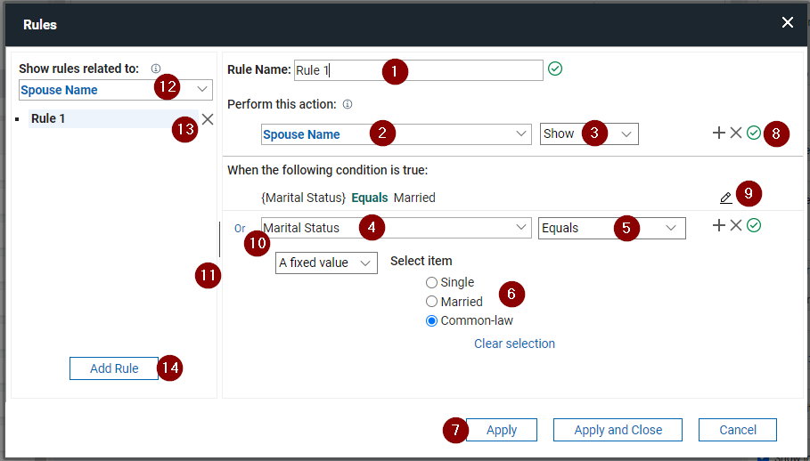
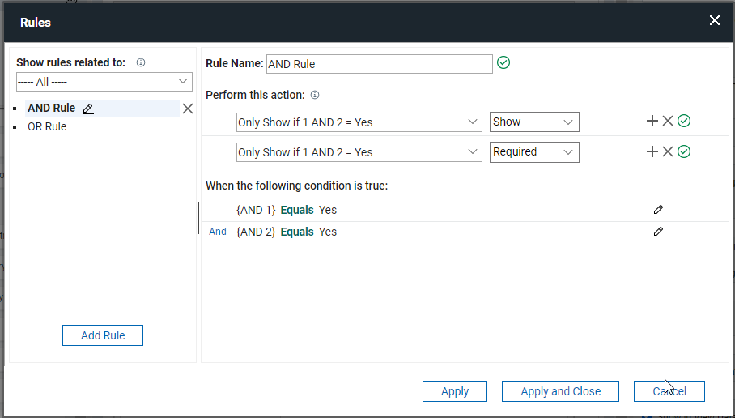
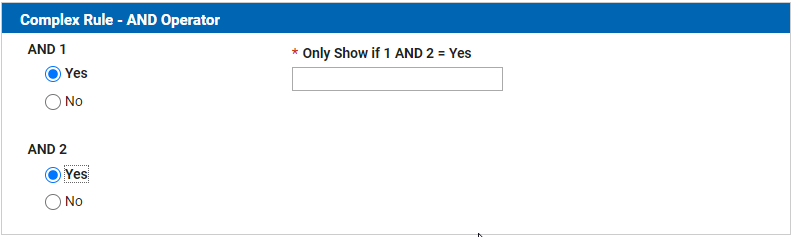
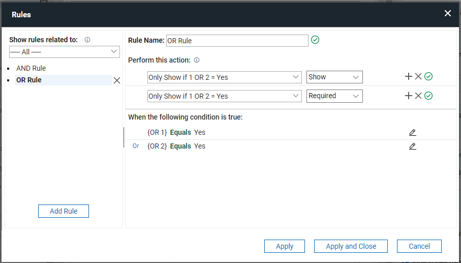
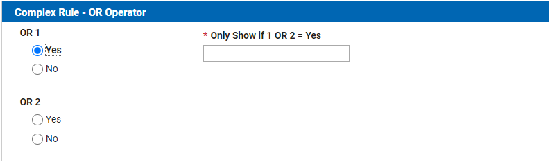

# Creating rules in your application 

Rules help you gather the correct information from users and organize your information after data is entered in a form. You can create composite rules that govern how your form, and the data in your form behaves.

With the Rules feature, you can create a dynamic user experience that ensures accurate data capture, and enforcement of business rules. Rules allow you to guide the user through the form by hiding questions, or pages, that are not relevant. Rules also allow you to enforce your business validation rules within the form to ensure that data is valid before the form is submitted. The following steps describe how to set rules that require users to enter more information depending on how the first question is answered.

## Rule Dialog



1. The rule may be given a custom name by entering it into the Rule Name field.

2. Each Rule can perform multiple actions; hide/show, enable/disable, required/not required, valid/not valid.  When you define an action, the inverse is also true.  For example in the above screenshot, if marital status equals “Married” of "Common-law" then name of spouse will be shown which also means if marital status is “Single” or not selected then name of spouse will be hidden.

3. The action action to perform, see [Rule Actions](#rule-actions-section).

4. The field that is part of the condition.

5. The operator, see [Rule Operators](#rule-operators-section).

6. The field value that is part of the condition.

7. **Apply** will create the rule but leave the dialog open, **Apply and Close** will create the rule and close the dialog, and **Cancel** will close the dialog and it will not keep any changes made since the last time “Apply” was clicked or the dialog was opened.  If you navigate to a different rule, before applying your changes you will see a dialog warning of unsaved changes.  If you click “Apply Changes” then your rule modifications will be saved.  If you click “Discard Changes” then any changes made will be thrown away.  If you click “Cancel” then the attempt to navigate away from the current rule will be canceled.

8. Add or remove additional actions.

9. Edit a condition.

10. Change the relationship of the conditions.  If there are multiple conditions they will either be evaluated where all must be true ("AND") or where only one must be true ("OR").

11. The vertical separator can be dragged left or right to change the size of the panes.

12. Filters the rules shown on the left based on the field selected.

13. A saved rule.  Clicking on the 'X' will prompt the user about deleting the rule; clicking 'yes' will delete the rule.

14. Click 'Add Rule' to add a new rule.

**Note:** As you create rules it is important to remember that rules can affect each other and in some cases completely counteract what you have defined.  You should never refer to the same item in the “Perform this action” section for multiple rules.  The general rule here is that if there are conflicts then the “last” rule wins.

## Rule Operators {.section}

The operator defines how the operands will be evaluated.  The available operators will change based on the items referenced within the rule.

| Operator      | Description |
| :------------ | :---------- |
| After | Returns true if the date specified is “after” the exact value or the value of the other form item specified. |
| Before | Returns true if the date specified is “before” the exact value or the value of the other form item specified. |
| Between | Checks if the value of the selected field falls alphabetically between either two fixed values or other form items.  i.e. “Red” is between “Green” and “Yellow” because “R” is between “G” and “Y” in the alphabet.  Case matters here, as the string is evaluated against the alphabet by first scanning the uppercase letters (A-Z) and then the lowercase (a-z).  For example if you specified between “Green” and “brown”, then “Red” would be valid but “red” would not, because the alphabet range would be A-Z + a-b. |
| Contains | Does the specified string contain the fixed value or other field value. This function recognizes case. |
| Day is | Compares the day of the date specified with an exact value or the value of another item. |
| Does not equal |   |
| Does not include |   |
|Ends With | Does the specified string end with the fixed value or other field value. This function recognizes case. |
| Equals | Does the specified string equal the fixed value or other field value. Case matters, “c” does not equal “C”. |
| Follows | Does the specified string come after the fixed value or other field value in the alphabet. i.e. “Red” follows “Green”.  This function recognizes case. |
| Includes |   |
| Matches | Does the specified string match after the fixed value or other field value.  Similar to contains, it is true if the specified string can be found anywhere in the value.  This function recognizes case. |
| Month is | Compares the month of the date specified with an exact value or the value of another item. |
| Precedes | Does the specified string come before the fixed value or other field value in the alphabet. i.e. “Red” precedes “Yellow”.  This function recognizes case. |
| Starts with | Does the specified string start with the fixed value or other field value. This function recognizes case. |
| Has value	|  |
| Has no value |  |
| Year is |	Compares the year of the date specified with an exact value or the value of another item. |

### Number/Currency Operators

These are the operators for number and currency fields.

| Operator      |
| :------------ |
| Between |
| Does not equal |
| Equals |
| Greater than |
| Greater than or equals |
| Less than |
| Less than or equals |

### Single Line / Multi-Line Operators

These are the operators for single-line and multi-line fields.

| Operator      |
| :------------ |
| Between |
| Contains |
| Ends with |
| Equals |
| Follows |
| Matches |
| Precedes |
| Starts with |
| Has value |
| Has no value |

### Select One / Checkbox / Dropdown Operators

These are the operators for select one, checkbox and dropdown fields.

| Operator      |
| :------------ |
| Equals |
| Does not equal |
| Has value |
| Has no value |

### Select Many Operators

These are the operators for select many fields.

| Operator      |
| :------------ |
| Matches |
| Does not match |
| Includes |
| Does not include |
| Has value |
| Has no value |

### Time / Timestamp Operators

These are the operators for time and timestamp fields.

| Operator      |
| :------------ |
| After |
| Before |
| Between |
| Has value |
| Has no value |

### Date Operators

These are the operators for date fields.

| Operator      |
| :------------ |
| After |
| Before |
| Between |
| Day is |
| Equals |
| Has value |
| Has no value |
| Month is |
| Year is |

## Rule Actions / Behaviors {.section}

Rules can be set for the following actions/behaviors:

### Show or Hide

You can set data entry items, buttons, and containers to be hidden, or visible.

### Enable or Disable

You can set buttons and data entry items as enabled or disabled.

### Valid or Not Valid

In a data entry item, such as a **Single Line Entry** field, you can set conditions on what type of information is acceptable. For example, in a timesheet application, you can set a rule that the check-out time cannot occur before a check in time.

### Required or Not required

You can choose whether you want data entry items to be mandatory, or optional.

## Additional general information on Rules

-   You can add multiple Boolean operators, such as AND, and OR, for each rule. However, you cannot mix the two conditions in a rule.
-   You can name and rename rules. It is useful to give each rule a unique and descriptive name. If you have several rules with similar operations, a descriptive name lets you quickly find the specific rule without having to open each one to view the details.
-   You can search rules based on form item.
-   To set a new rule, use the **Edit rules** icon in each form item. You can also create rules for pages and buttons. You can use the icon to open a rule and edit it.
-   After a rule is set, a checkmark appears on the Rule icon for the form item, as well as any form item involved in the rule. This makes it easy to see which form items are used in rules.
- If you attempt to delete a form item that is used in a rule. If you agree, you delete the rule. If you duplicate a field, the rule is duplicated with it.
- A field's value is not cleared if its behavior changes because of a rule.  You may need to explicitly clear the value if you do not want the previously entered value to be saved.

**Note:** When you set rules for Number or Currency form items, you must set the default value of the form item to zero in the **Properties** side panel. In the **Properties** side panel, set the minimum value to zero. If the Number or Currency form item is blank, it does not default to zero, and any rule you set does not work properly.

-   **[Setting rules on form items](ru_set_rule_on_form_items.md)**  
You can set rules that govern how form items appear in a form.
-   **[Setting rules on pages in an application](ru_setting_rules_on_pages_in_an_application.md)**  
You can set rules that govern how pages are shown or hidden in a form.
-   **[Setting rules on Stages](ru_setting_rules_on_stage_actions.md)**  
You can direct the workflow of an application by setting rules on buttons within Stages.

## Examples

### Rule with an 'and' condition

This example demonstrates a rule using an 'and' condition.  The field will be visible and required if both questions are 'Yes'.



The next image shows the rule in action.



### Rule with an 'or' condition

This example demonstrates a rule using an 'or' condition. The field will be visible and required if either of the questions are 'Yes'.



The next image shows the rule in action.



### Handling more complex logic

The Rules dialog does have its limitations and you may find that you have certain scenarios where you need additional flexibility.  You can create your own customized behavior by using JavaScript.

Within JavaScript we can create any complex comparison.  There are a few things that you need to know to get started creating your own logic:

- The AND operator in JavaScript is &&
- The OR Operator in JavaScript is ||
- You can control the order that conditions are evaluated by wrapping them in parenthesis. The example below, the condition will be true if a=1 AND b=2 OR if c=3 AND d=4.

```javascript
if ( (a == 1 && b == 2) || (c == 3 && d == 4) ) {
  // do something
}
```

**Parent topic:** [Adding dynamic behavior](cr_adding_dynamic_behavior.md)

