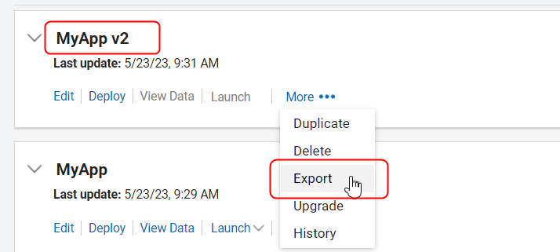
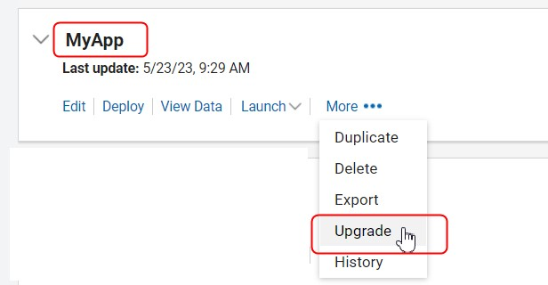
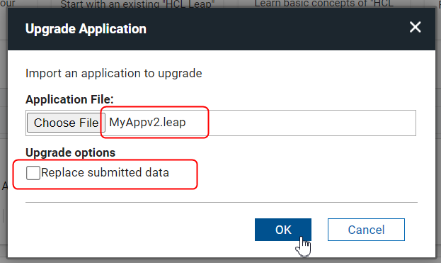

# Upgrading an application design {#untitled1 .task}

The upgrade feature allows an application design to be replaced by a new version.

You many want to make significant changes to your application but do not want to affect the running version while you finalize the details. If you create a copy of the application, using export and import, you can make and test all changes. The copy can be edited, deployed, and records submitted without affecting the original application. Once you have completed the changes on the application copy, you can upgrade the original app with the export of the copy. The original app will maintain its application identification, but will also contain all the changes from the copy.

1.  **Export** an existing application:

    

    Select a local directory where the application file will stored.

2.  Select **New Application** \> **From Existing** \> **Next**.

3.  Choose the application from your local directory and click **Create**.

    **Note:** The imported application will have the same name as the original - edit the name to distinguish it from the original. It is also recommended that you change the access permissions so that others may not use the application while it is in development.

4.  Edit the new application to work on the next iteration of the app. This can be deployed and tested, without interfering with the original application.

5.  When satisfied, **Export** the new application \(without data\):

    

6.  In the original application, select **Upgrade** and choose the exported new application \(ex. MyApp v2\).

    **Note:** Do not check **Replace submitted data**.

    

    

7.  This will result in the older app \(MyApp\) being upgraded to the newer version. Decide if you are going to keep the copy for further future edits or delete it.

**Parent topic: **[Creating and managing applications](cr_creating_and_managing_toc.md)

