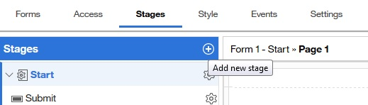
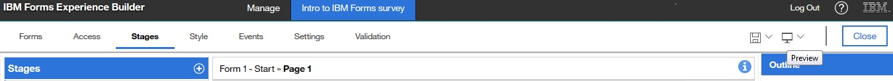
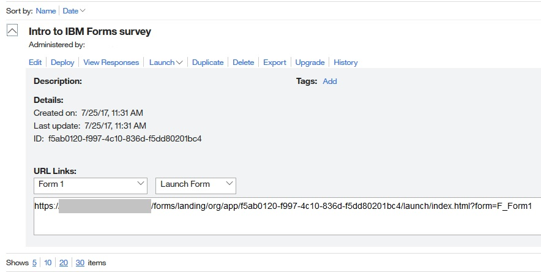

# What is HCL Leap, and how is it used? 

This document provides an overview of the three main activities that are involved in using Leap.

There are three main activities that are involved in using Leap:

-   Building forms
-   Publishing applications
-   Reviewing submissions

## Forms and Applications { .section}

Throughout the Leap documentation, the words form and application are both used to describe the output that is created by Leap. Forms are a single page, or collection of pages, that create the user interface with which people interact. When a form is combined with workflow, presentation logic and other elements of the Leap technology, it becomes an application. Applications gather the submitted input and automatically store the submissions in a database.

## Building forms { .section}

When you start Leap, you are shown a screen with two tabs on the Forms toolbar: Use and Manage. The **Use** tab shows a list of all applications that are created by other users to which you have access. The **Manage** tab is where you create and manage applications. When Leap opens, you are shown the **Manage** tab, which displays any applications you created, or for which you have edit permissions.

To create an application, click **New Application**, enter a descriptive application name, and select **Create**. A blank form is displayed.

Drag items from the Palette and drop them onto the form. As you add items, you can change the default name of each item directly on the form. Click the name of the widget on the canvas to edit the name.

A built-in grid automatically aligns items on the form, and expands vertically when you add items to the form. The default layout is two columns and two rows. However, you have flexibility when you build your form. You can stretch one form item to span across all columns, and you can add and delete columns and rows as needed. Click any border of a column or row to access a menu with options for expanding or contracting your form.

When you click the **Rules** icon, you can create rules for form items or for other objects. You can set a rule to show or hide a form item, page, or other object that is based on user input.

Some form items must be edited by changing their properties. For example, you can add the survey questions on the form, but the question titles can be edited only in the properties panel.

When an item is selected the properties panel appears on the side of the screen. There are many tabs within the properties panel where you can set various functions. For example:

Properties tab
:   Edit properties such as whether the title of a form item appears on the form. The properties that are displayed vary based on the form item.

Event tab
:   Define an event that happens based on user input, such as when the user selects a particular option.

Formula tab
:   Create mathematical expressions to calculate field values and validate form data.

## Adding workflow elements to a form { .section}

There are many cases where adding separate steps and restricting user access to part of a form makes the form more useful. For example, you can create a vacation request form that requires the approval of a supervisor, or an award nomination form that requires the approval of both a supervisor and a nomination committee. In the survey form example, the results from the survey are useful feedback, but by adding workflow elements, the curriculum supervisor can review comments before sending them to the instructor. Adding workflow elements is done with Roles and Stages.

Adding or editing Roles is done in the **Access or Workflow** tab. Adding stages is done in the **Workflow** tab.

Roles – You can create various roles with different levels of access to different information within an application. For example, you can specify that only an administrator can change an application, managers can review submitted data, and users can complete and submit the form. After roles are defined, you can assign users to the roles. Each role can have as many or as few people assigned to it as needed. You can even assign groups to a role. For example, all supervisors are assigned to one role, and all managers are assigned to another role.

In the **Access** tab, each role can either be Open or Closed. If you have a web service, which pre-populates the role information, select **Open**. For example, you want to use a web service to scan the company email directory and automatically populate the name of the manager. If you do not plan to use web services in your application, leave the role **Closed**. The user must enter the name of the manager manually when they complete the form.

Stages – Stages are the steps that a form goes through in its lifecycle. For example, in one stage the user submits data. In the next stage, the manager reviews and approves or rejects the submitted data. An application can have as many stages as needed. Stages are also useful as they allow a submitter to save a draft version of the form. For example, on a census form that has multiple pages, the submitter might not have time to complete the whole form in one session. With the **Draft** button, the user can complete part of the census, save a draft, then return to complete the census later. A stage can hide or display information that is necessary for one user, but not required for another. For example, in our survey form, the curriculum supervisor must see the name of who submitted the feedback. However, to allow for anonymous feedback, the user's name is hidden when the feedback is forwarded from the curriculum supervisor to the course instructor.

By default, every form has a **Start** and **Submitted** stage. The **Start** stage is the first stage of every form. The **Submitted** stage can be modified and other stages added.

To create a workflow, add stages in the **Workflow** tab. You may hover over the stage and click the plus icon, or click on “+ Add Stage” in the properties pane.

When a new stage is added, you can modify its properties to build the form workflow as needed. For example, you can add a stage to a survey that thanks the user for submitting feedback and sends the curriculum supervisor an email that indicates that new feedback is available. After the feedback is reviewed by the supervisor, another stage can be added to block the user's name and company information and then forward the feedback to the course instructor.

At any time during the form building process, you can save and preview your work in a web browser by clicking **Preview**.

Ensure that your browser does not block pop-up windows because the preview form opens in a new window. The **Submit** and **Cancel** buttons are automatically added to your form, and are displayed when you preview the form.

## Deploying your application { .section}

When you complete building your form and adding workflow elements, you must deploy your application to make it available to users. Deploying applications is done in the **Manage** tab.

To deploy your application, click **Deploy**. A menu of deployment options is available. You can set your application to have a specific start and end date, and provide a custom message to instruct users when the application is unavailable.

After an application is deployed, you can provide the URL link to your users.

You can also get the URL to the application by clicking **Launch** and copying the address in the web browser. If you must change a form after it is deployed, you can do so at any time. However, you must deploy the form again after you complete your changes.

## Reviewing submitted data responses { .section}

When users access the application and submit results, the form author, administrator, or other roles with appropriate access can view the submitted results. In the **Manage** tab, each application has a **View Data** link. When the View Data link is clicked, you can choose to analyze submitted responses by viewing summary charts or response records.

The Summary screen displays the survey results in customizable charts. The View Data screen displays all submitted responses in a table. You can sort the submitted results by clicking any of the column titles. Selecting a response displays the submitted data in a new window.

Forms that have extra stages have extra buttons in the View Data screen. For example, the curriculum supervisor has a button to accept the feedback, which forwards the feedback to the course instructor. In another example, such as a vacation request form, the manager can either accept or reject the vacation request. If the manager accepts the request, the request is forwarded to Human Resources to log against the available vacation days. In all cases, an email with the decision of the supervisor is sent to the employee.

You also can export all data to a spreadsheet program, such as Open Office, or Microsoft™ Excel.

## Conclusion { .section}

This overview described the three high-level steps for creating Leap applications: building the form and adding workflow elements, deploying your completed application, and reviewing the submission results. For more Leap information, see:

-   [Building a Survey application](tut_survey_application_OV.md) – Use Leap to design and publish a basic survey application.
-   [Building Apps](cr_creating_and_managing_toc.md) for more specific instructions on various parts of creating a Leap application.
-   [HCL Software U: Application development](tut_video_overview.md) – a 7-minute video that walks you through the activities that are described in this overview. The video describes how to open a new application, add items to a form, publish an application, and review submitted results.
-   [Leap Starter Packs](https://www.ibm.com/developerworks/community/wikis/home?lang=en-us#!/wiki/W65fd19fc117a_4d18_87e4_5f7b8a6727cc/page/FEB%20Starter%20Packs) – a series of prebuilt forms you can import into Leap and modify for your own use.

