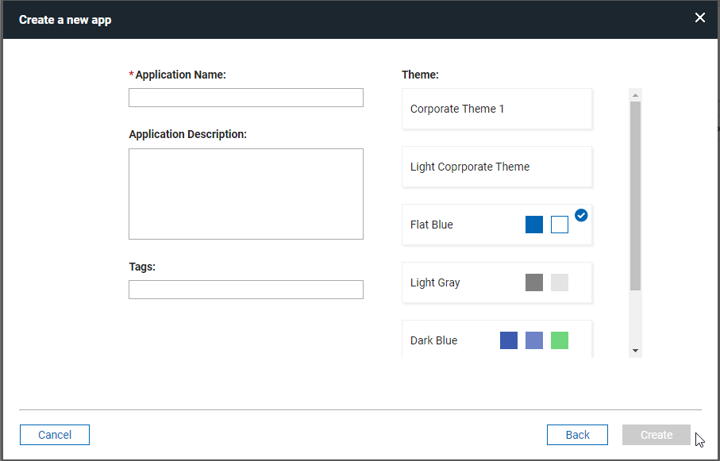

# Styling your application

This topic provides details on improving the look of your application by apply and working with CSS.

## Styling your application with a custom theme

[Styling your application with a custom theme](cr_custom_theme.md) provides details on styling the colors, fonts, and other characteristics of the application by creating or importing a custom theme.

<!---   An application can have one theme; the theme is applied to all forms in the application.
-   Themes are customized in the **Style** tab.
-   Settings made in the **General** section of the **Theme Editor** will be applied to specific attributes of all items in your application, but will be overridden by settings made to a more specific item type. For example, settings made in **General** \> **Fonts** \> **General** can be overridden by values set in **General** \> **Fonts** \> **Label Fonts** or set in **Buttons** \> **Fonts**.
-   A section's background color and border visibility can be set in the item's properties. This will override the theme settings.
-   Background images maintain aspect ratio, but are stretched to fit the browser window.
-   During application design, themes, and custom CSS are not applied to your application. To see how your application will display to end users, use the **Preview** button in either the **Theme Editor** dialog or the main banner.
-   Browsers support different font file types \(eg. .woff, .woff2, .ttf, eot, and .otf\), so when specifying a custom font in your theme, you may need to include multiple font file types for a specific font family in order for it to render in all browsers.
-   Themes can be exported and then imported into another application.
    -   To increase the portability of your customized theme, use the option to **Maintain a link to the file only** for font files and background image, instead of importing them into your application.
-   Some limitations exist in IE8, including differences around the way IE8 displays background images.
-   Custom CSS can be used in combination with themes.
    -   Custom CSS that you have included in your application is applied after all theme styling is applied except when the replace theme checkbox is selected. In this case, the custom CSS is the only styling that is applied to your application. CSS precedence rules still apply though, so some custom CSS may not override all theme settings.
    -   The **Show CSS** feature in the **Style** tab can be used by custom CSS developers to understand the CSS that is being generated by the theme.
    -   Custom CSS is not applied to the sample form in the **Theme Editor** dialog but is applied to the sample form in the **Style** tab.-->

## Using CSS files

[Using CSS files](ex_css_toc.md) details the use of custom CSS themes that can be uploaded into an application to style the user interface to meet customer needs.


## Creating a global corporate theme

Leap provides the ability to create your own global (or corporate) theme that can be selected from the application creation dialog.



- A global corporate theme must be configured by the Leap server admin using the Leap properties.
- The CSS file that contains all the custom classes must be created and hosted in an accessible location.

The following is an example of a corporate theme configuration:

```text
ibm.nitro.NitroConfig.customThemes.1.displayName = Corporate Theme 1
ibm.nitro.NitroConfig.customThemes.1.nl.fr=Thème d'entreprise 1
ibm.nitro.NitroConfig.customThemes.1.isDefault = false
ibm.nitro.NitroConfig.customThemes.1.location = http://pnp.hcl.com/theme1.css
```

## Using Custom css class name

Forms, pages and items have a property called "Custom CSS class names".  This property accepts one or more class names separated by spaces.  The class name provided is added to the object and can be referenced by a CSS class definition.  

For example, if you added 'redBackground" to the 'Custom CSS class names" property, you could define the following class to change the styling for that item:

```css
.lfMn .redBackground {
  background: red;
}
```

**Note:** In some situations you may need to override a default styling by adding "!important" to the style definition.

## Using in-line CSS

Custom CSS styles can also be added to the form in an HTML item and they will be evaluated when the form is loaded.  Styles defined like this only apply when the form they are contained in is loaded.

```html
<style>
  
.lfMn.lotusui30 .lotusBanner
{
  display:none;
}
.lfMn.lfSingleFormArea .lfFormTitleBar {
  display:none;
}
  
</style>
```

## Using custom fonts

You can use custom fonts in your applications.

Either attach or reference the font files in the Settings / Files tab.  If you are referencing the files via URL make sure you have the correct permission to do so otherwise they will not load. 

Once attached or referenced the fonts will appear in your font options in the Style Editor.

### Using Google Fonts

Google offers over 600 font families for web developers. They are free, easy to use and reliability is excellent. This brief tutorial will tell you what you need to know to use Google fonts in your applications.

1. Go to the [Google font library](http://www.google.com/fonts) and select your fonts. Once you chose the font you want click the Quick-use icon.

2. Download the font and add to your form OR add the font to your style sheet.

3. Create and apply classes that use the Google font


**Example of class that references the font attached to the form**

```css
.lfMn .rancho
{
  font-family: 'Rancho', cursive !important;
  color: blue !important;
}
```

**Example of css file that imports the font**

```css
@import url(https://fonts.googleapis.com/css2?family=Rancho&display=swap);

.lfMn .rancho
{
  font-family: 'Rancho', cursive !important;
  color: blue !important;
}
```

**Note:** the css file must be added to the form and selected on the Style page.

4. Launch the form to see the font appear in the form! 

## Samples

**Hide Banner**

Hides the Leap header/banner at the top of the form.

```css
.lfMn.lotusui30 .lotusBanner
{
  display:none;
}
```

**Hide Form Toolbar**

Hides the form toolbar that contains the print and delete button for a submitted form.

```css
.lfMn.lfSingleFormArea .lfFormTitleBar {
  display:none;
}
```

**Change cursor pointer**

Change the image that is used for the mouse cursor.

```css
.lfMn .cursor {
  cursor: pointer;
}
```

**Change field alignment**

Sets the field value to be aligned on the right.

```css
.lfMn .rightAlign .dijitTextBox {
  text-align: right;
}
```

**Dynamically change table cell background based on value**

Here is a sample function, which will change the background color of a table cell based on the text it contains ('Complete' = green, 'Incomplete' = red and 'In Progress' = yellow). It uses the dojo functions query and style, which we do not document in Leap documentation but are part of the dojo documentation.  You can see these are other functions that work in Leap at https://help.hcltechsw.com/domino-leap/1.1.4/ref_jsapi_javascript_security.html

**dojo.query** returns all the nodes that match the specified criteria, generally a css class

**dojo.style** applies a style to the specified node 

```javascript
app.getSharedData().applyTableStyle = function()
{

  // find all the table cells
  var e = dojo.query("td.dojoxGridCell");

  // loop all the cells and apply style matching criteria
  e.forEach(function(itm) {
    if(itm.innerText == 'Complete')
        dojo.style(itm, "background-color", "green");
    if(itm.innerText == 'Incomplete')
        dojo.style(itm, "background-color", "red");
    if(itm.innerText == 'In Progress')
       dojo.style(itm, "background-color", "yellow");
  }); 
}
```

If the table is populated by the user, you apply the styling in the *onItemChange* event of the table:

```javascript
app.getSharedData().applyTableStyle();
```

If you populate the table from a service call, you could apply the styling in an *onCallFinished* handler:

```javascript 
var srv = form.getServiceConfiguration("SC_REPLACE_WITH_SERVICE_NAME");
srv.connectEvent("onCallFinished", function(success, errorObj) {
  if (success) {
    app.getSharedData().applyTableStyle();
  } 
});
``` 

**Note:** this will affect ALL tables in the form, therefore if you need to scope this to a specific table then you will need to apply a custom css class and then reference that in the query, i.e. "myStyledTable td.dojoxGridCell"

**Parent topic:** [Building Apps](cr_creating_and_managing_toc.md)