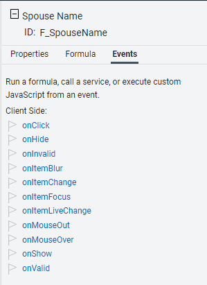
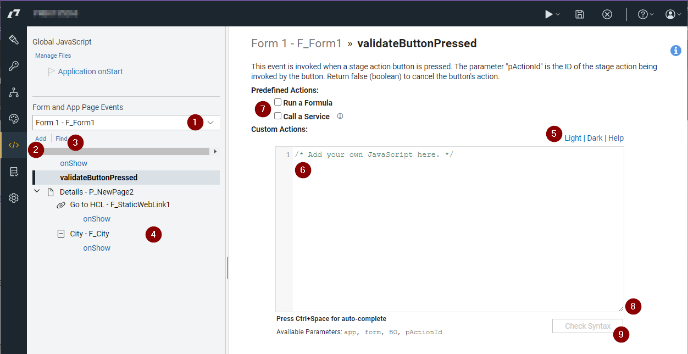

# Adding JavaScript

You can also further customize your form's behavior by adding custom javaScript.  {{shortProductName}} provides a javaScript API that provides objects and functions to modify the form programmatically.  JavaScript is triggered in the browser by an *event*, there are many events that can be used for this purpose.  For more details on the events available, refer to [Running Custom JavaScript - Events](ref_jsapi_running_custom_js_events.md).

## Form item events

Every item within a {{shortProductName}} form has a set of events that can be used for applying custom javaScript.  You can access the events by clicking on the form item and then clicking the 'Events' tab in the properties pane.

## Events Page

You can also use the 'Events' page by clicking on the '</>' icon in the left vertical navigation bar.

1. Filters the javascript based on the selected *form* or *appPage*.

2. Click 'Add' to add an event to the view pane so that javaScript may be added.

3. Click 'Find' to filter what is shown in the 'view pane' by code that contains the specified text.

4. The 'view pane' where the events that contain javascript or predefined actions will appear, grouped by page.

5. Change the color scheme of the page.

6. Code editor.  The editor has code coloring, line numbers, and indenting.  You can access our 2 auto-complete menus by pressing ctrl+space; the first menu shows the forms and their fields and the second shows common javaScript functions or code templates.

7. Apply a predefined action to the event.

8. A drag handle to change the size of the code editor window.

9. Press the 'Check Syntax' button to validate any code that you write.  The form will not save properly if you have invalid javaScript code.

## Debugging

If you are looking to investigate/debug code you can add "debugger;" to any line of the code to create a break-point.  If you view the page with the browser developer tools enabled then the code will stop executing at that point and you can then step through the code one line at a time.

One the breakpoint has been triggered, you can step one line at a time and also into or out of functions.  This is a great tool for helping you figure out what might be broken in a function that you write.  You may also add expressions or variables to the "Watch Expressions" section to show you the value of code statements as you progress through your function(s).

!!! note
    Be sure to remove any breakpoints ("debugger;") in your code before publishing your application for final consumption.

- **[Sample Functions](js_sample_functions.md)**

**Parent topic:** [Adding dynamic behavior](cr_adding_dynamic_behavior.md)