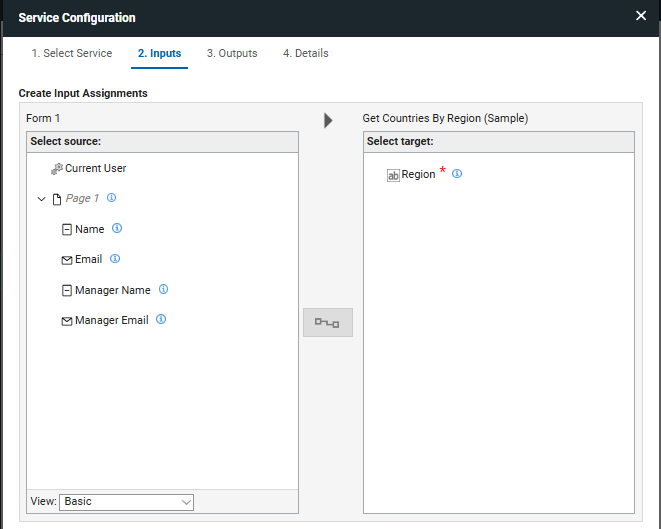
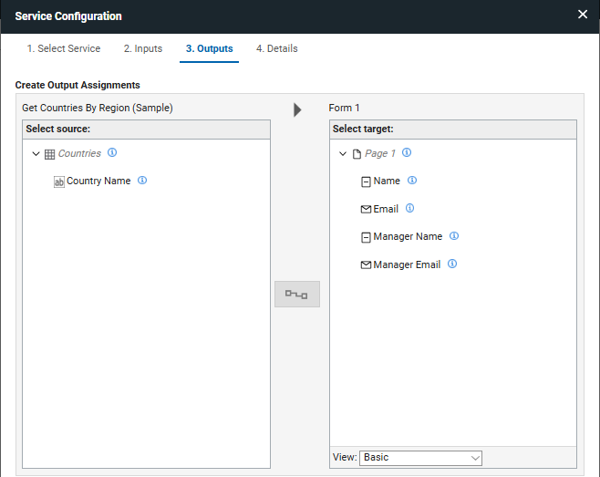

# Incorporating web services into your applications { #usingapplicationsasservices .concept }

## What is a service
A service is an operation that allows {{shortProductName}} to communicate with other systems.  Using a service you could call external applications like a servlet, web service or REST API.  You can also communicate internally with any {{shortProductName}} application on the same server.  Services can return a single item or a list of items.  Internal services can be used to search, retrieve, update, create or delete {{shortProductName}} records.

Services are specific to a form, and an application can contain multiple forms.

## Selecting a service

The first step to configuring a service is to select the service that you want to use.  The service may be a globally available service, another {{shortProductName}} application or a custom service that you (or your organization) have created.  Regardless of the type of application the selection is made from the same screen.

1. Click on the **Settings** tab.
2. Under Services on the left side of the screen, select the form on which you want to register your service.
3. Any global and custom services that you may have installed will appear in the General Service Catalog.

You can also select {{shortProductName}} applications to create a service that will inspect an existing {{shortProductName}} application.  All applications you have permission to access will appear in the result list.

## Mapping inputs

Every service can be filtered by defining input assignments.

On the left side is a list of all the fields in your form that can be used as inputs. You can switch the **View** to **Advanced** to see additional field properties or to **Constant** to specify a hard-coded value.

On the right side is the list of searchable targets for the service.

To create an assignment, select an item from the left side and the corresponding item from the right side, then click the **Assignment** button in the middle. Here are a few key points to understand about defining inputs:

- A service can have any number of inputs
- The assignments that you create must be of the same data type
- When multiple inputs are defined they will be applied as an AND relationship, which means that the results must match all the specified criteria.

## Mapping outputs

Every service returns some type of feedback.  The items returned by a service call can be linked to items in your form to either render the results, or affect the behavior of the form.

On the left side is a list of the items that the service returns.

On the right side is a list of items in your form where you can link the output.

To create an assignment, select an item from the left side and the corresponding item from the right side, then click the **Assignment** button in the middle. Here are a few key points to understand about defining outputs:

- The assignments that you create must be of the same data type
- The assignments must be the same structure, if a list is returned then you can only link it to list items (such as, dropdown, table, select one or select many).
- If you change the view to **Advanced**, you will see additional properties available for assignment. You can set the value, an item's validity, or the invalid message. A common example is performing a search (allowing only one record) and creating an output assignment between Found No Matches and a field's Valid property.

The following topics describe how to incorporate web services into your {{fullProductName}} application.

-   **[Adding and configuring a service](cr_in_app_service.md)**  
The following instructions describe how to add and configure a service so you can map it within your application.
-   **[Service Oriented Architecture – Exposing a service to {{fullProductName}}](cr_using_apps_exposing_service_to.md)**  
The following information is an overview of Service Oriented Architecture built into {{shortProductName}}, and describes how to expose a service to {{shortProductName}}.
-   **[Triggering a service](se_triggering_a_web_service_from_a_button.md)**  
You can use a service to add information to a form automatically after a user triggered event.
-   **[Using a service to populate form items](se_using_a_service_to_populate_a_drop_down.md)**  
You can use a web service to populate to a Drop Down, Select One, and Select Many form item.
-   **[Cancelling user submit event](se_cancel_submit-event.md)**
Demonstrates how to cancel the user initiated submit event, call a service and then re-trigger the form submission.
-   **[Integrating your application with existing {{fullProductName}} applications](cr_using_other_apps_as_services.md)**  
Each {{shortProductName}} application can be used within another {{shortProductName}} applications as a service.

**Parent topic:** [Adding dynamic behavior](cr_adding_dynamic_behavior.md)

