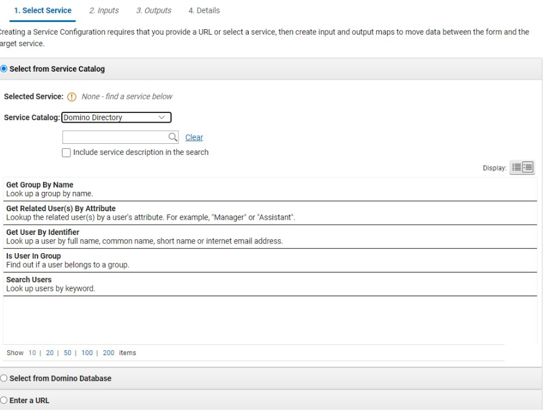

# Directory services

Directory service is a new built-in service that allows app builders to look up users and groups to use in various parts of a Domino Leap application. This service is useful in assigning users or groups to a role, or anywhere in the application where a person or group needs to be dynamically retrieved.

!!! note
    The service retrieves various pieces of data from the Domino directory. It is a read only service - it will not update the directory.

## Where is the Directory Service?

Directory Service is available in the Service Definition dialog, in the first category “Select from Service Catalog.” In that category, Domino Directory is a new entry in the Service Catalog dropdown. Once selected, the user is presented with five operations from which to choose:

- **Get Group By Name** - Given an input value, this operation will return a group object.

- **Get Related User(s) By Attribute** - Given two input values, the name of the user, and the attribute that will identify the other user (such as a manager attribute), return a user object.

- **Get User By Identifier** - Given an input value of either the user name or the email, find the corresponding user object. Returns a single result. There are many attributes returned by the service, but if you are populating a dynamic role, the best choice to bind as an output value is the User ID.

- **Is User In Group** - Given two input values, the name (or email) of a user and the name of the group in question, returns a boolean value indicating whether or not the user is in the group.

- **Search Users** - Return a set of users that match input criteria, provided the attribute is a sorted column in the Domino directory’s Person view.

## Standard user attributes

When a user object is returned, the following attributes are available to bind as output values in the services dialog:

- User ID
- Internet Email
- User Name
- Display Name
- First Name
- Middle Name
- Last Name
- Personal Suffix
- Personal Title
- Aliases
- Short Name
- Domain
- Employee Number
- Job title
- Location
- Office Phone
- Manager
- Assistant
- Alternate Full Name

!!! note
    Though these attributes are available to use as output parameters, not every organization’s directory may populate all the fields. For example, the Employee Number is a field in the Person document in the Domino directory, but it may not have any values in the actual directory being used.

## Standard group attributes

When a group object is returned, the following attributes are available to bind as output values in the services dialog:

- Group Name
- Internet Email
- Display Name
- Group Type
- Category
- Description

As with users, there is no guarantee that every attribute will be in use in a particular organization’s directory. For example, not all groups will have an internet email.

## Directory Service use cases

The Directory Service is very convenient for use in populating a dynamic role. For example, in the **Assign Users to Role** action available on any of the submit buttons on the Stages page, you could use the **Get Related User By Attribute** operation on the Directory Service to look up the manager of the current user to put the manager in an Approval role for that record.

Or an application could simply want to display information about a person, and the Directory service enables the user to retrieve the attributes from a service result (like Assign Users) and bind the values to data on the form.

**Parent topic:** [Incorporating web services into your applications](cr_using_apps_as_services_toc.md)